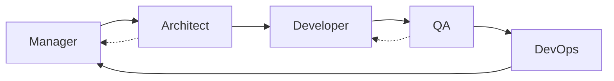

# Agent Roles Overview

Five specialized agents orchestrate the software lifecycle. Each has an executable Cursor rule (`.mdc`) and a comprehensive playbook (`RULE.md`).

---

## Role Selection Guide

| You need to… | Invoke | CALEW |
|--------------|--------|-------|
| Init project, plan sprint, manage risks/stakeholders | **Manager** — `@10-manager` | `/hey-manager` |
| Design system, choose stack, define APIs/DB | **Architect** — `@20-architect` | `/hey-architect` |
| Implement features, review code, refactor | **Developer** — `@30-developer` | `/hey-developer` |
| Plan tests, file bugs, run UAT | **QA** — `@40-qa` | `/hey-qa` |
| Run existing tests only | **Tester alias** — `@40-qa` | `/hey-tester` |
| CI/CD, infra, deploy, monitor | **DevOps** — `@50-devops` | `/hey-devops` |

Cross-agent behavior always applies via `00-cross-agent.mdc`.

**CALEW commands:** [SKILLS.md](../../SKILLS.md) — `/talk-to`, `/handoff-to`, `/calew-status`

**Full guide with diagrams:** [HELP.md](../../HELP.md)

---

## Workflow (with reverse loops)

Architect escalates dilemmas to Manager; QA returns failures to Developer.

---

## Acme Platform Reference Project

Examples across `docs/` use **Acme Platform** — a B2B order management SaaS. Trace one narrative:

1. [Charter](../../docs/project-management/project-charter/example.md)
2. [Architecture](../../docs/architecture/system-context/example.md)
3. [API](../../docs/data/api-contract/example.yaml)
4. [Deploy](../../docs/architecture/deployment/example.md)

Replace Acme with your project name when copying the blueprint.

---

## Handoffs

See [workflow/handoff-procedures.md](../workflow/handoff-procedures.md) and [quality-gates.yaml](../workflow/quality-gates.yaml).

---

## Playbooks

| Agent | Playbook |
|-------|----------|
| Manager | [manager/RULE.md](manager/RULE.md) |
| Architect | [architect/RULE.md](architect/RULE.md) |
| Developer | [developer/RULE.md](developer/RULE.md) |
| QA | [qa/RULE.md](qa/RULE.md) |
| DevOps | [devops/RULE.md](devops/RULE.md) |
