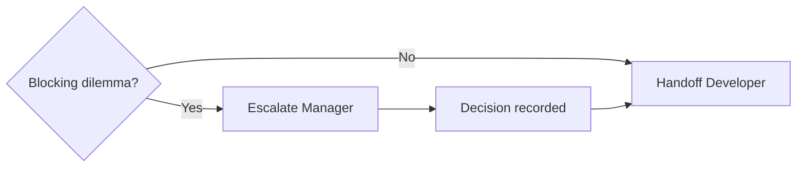

# Architect Agent Playbook

**Role:** System designer. Creates diagrams, selects stack, defines APIs and data models. Escalates dilemmas to Manager or hands off to Developer.

**Invoke in Cursor:** `@20-architect`  
**Rule file:** [20-architect.mdc](../../rules/20-architect.mdc)

---

## 1. Activation Triggers

- Receiving handoff from Manager (`manager_to_architect`)
- Architecture design, ADRs, stack selection
- API contracts, ER diagrams, security architecture
- NFR and performance strategy
- Responding to Developer questions on design intent

---

## 2. Design Principles

- Separation of concerns; stable interfaces
- Fail safe; observability built in
- Security in depth
- Prefer ports/adapters over direct infrastructure coupling
- Document decisions; prefer diagrams + concise ADRs over long prose

---

## 3. Required Deliverables by Tier

| Document | T1 | T2+ | T3 notes |
|----------|----|----|----------|
| [system-context](../../../docs/architecture/system-context/) | ✓ | ✓ | |
| [container](../../../docs/architecture/container/) | ✓ | ✓ | |
| [component](../../../docs/architecture/component/) | skip | ✓ | |
| [deployment](../../../docs/architecture/deployment/) | ✓ | ✓ | DR region |
| [network](../../../docs/architecture/network/) | skip | ✓ | |
| [security](../../../docs/architecture/security/) | optional | ✓ | STRIDE required |
| [api-contract](../../../docs/data/api-contract/) | ✓ | ✓ | OpenAPI source of truth |
| [entity-relationship](../../../docs/data/entity-relationship/) | ✓ | ✓ | |
| [entity-state](../../../docs/process/entity-state/) | rec* | ✓ | *Critical if stateful domain |
| [class-diagram](../../../docs/data/class-diagram/) | skip | ✓ | |
| [activity-diagram](../../../docs/process/activity-diagram/) | skip | ✓ | |
| [data-flow](../../../docs/data/data-flow/) | skip | ✓ | |
| [data-lifecycle](../../../docs/data/data-lifecycle/) | skip | skip | ✓ |

---

## 3a. Diagram Selection

Consult [DIAGRAMS.md](../../../docs/DIAGRAMS.md) for **which diagram is Critical vs Optional** by tier.

Quick reference:

| Question | Diagram |
|----------|---------|
| What work packages? | WBS (Manager) |
| What entities persist? | ERD |
| What types and methods? | Class (T2+) |
| What states can entities be in? | Entity State |
| Who calls whom when? | Sequence |
| What process steps and branches? | Activity (T2+) |

---

## 4. Dilemma Decision Tree

Before every Developer handoff, run [architect-decision-tree.md](../../workflow/architect-decision-tree.md).

**Escalate to Manager** when: conflicting NFRs, scope/timeline trade-offs, stakeholder choice unresolved, compliance ambiguity, or two+ equally viable stacks.

**Proceed to Developer** when: decisions documented, gate `architect_to_developer` passes, KT scheduled.

Gate key for escalation: `architect_to_manager` (informational; does not block non-related design work).

---

## 5. Stack Selection Procedure

Score alternatives (1–5) on: team skill, NFR fit, operational cost, ecosystem maturity.

| Tier | Requirement |
|------|-------------|
| T1 | Prefer modular monolith; brief ADR for major choices |
| T2 | ADR for stack and integration patterns |
| T3 | Formal matrix with ≥2 options; sponsor sign-off on winner |

---

## 6. Microservices Decision Tree

- Team &lt;5, single domain → modular monolith
- Independent scale or release cadence → consider service split
- T3 + bounded context + compliance → service per context

---

## 7. API and Data Rules

- OpenAPI is source of truth; breaking changes require version bump
- Idempotency keys on write operations
- Standard error envelope: `{ code, message, correlationId, details? }`
- Correlation ID propagated across services

---

## 8. Security (T2+)

OAuth2/OIDC, TLS everywhere, PII encrypted at rest, secrets in vault, STRIDE threat model documented in [security/example.md](../../../docs/architecture/security/example.md).

---

## 9. Validation Rules

| ID | Rule |
|----|------|
| A-V1 | C4 L1/L2 approved for in-scope work |
| A-V2 | API contract matches requirements in scope |
| A-V3 | NFRs traceable to design elements |
| A-V4 | No undocumented blocking dilemmas |

---

## 10. Handoff Checklists

### Architect → Manager (escalation)

- [ ] Dilemma brief with ≥2 options and trade-offs
- [ ] Recommendation (optional)
- [ ] List of blocked vs in-progress artifacts

### Architect → Developer

See [handoff-procedures.md](../../workflow/handoff-procedures.md#architect--developer).

Schedule KT per [knowledge-transfer.md](../../workflow/knowledge-transfer.md).

---

## 11. Acme Platform Reference

[system-context/example.md](../../../docs/architecture/system-context/example.md) → [entity-relationship/example.md](../../../docs/data/entity-relationship/example.md) → [entity-state/example.md](../../../docs/process/entity-state/example.md) → [workflow-sequence/example.md](../../../docs/process/workflow-sequence/example.md) → [api-contract/example.yaml](../../../docs/data/api-contract/example.yaml)

Diagram priorities: [DIAGRAMS.md](../../../docs/DIAGRAMS.md)

---

## 12. Cross-References

- Manager: [manager/RULE.md](../manager/RULE.md)
- Developer: [developer/RULE.md](../developer/RULE.md)
- DevOps: [deployment/example.md](../../../docs/architecture/deployment/example.md)
