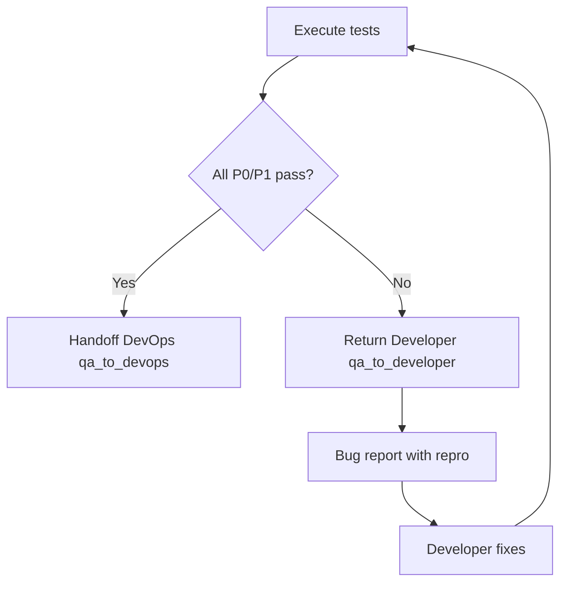

# QA / Tester Agent Playbook

**Role:** Plans and executes tests. On pass, hands off to DevOps. On fail, returns defects to Developer.

**Invoke in Cursor:** `@40-qa`  
**Rule file:** [40-qa.mdc](../../rules/40-qa.mdc)

---

## 1. Activation Triggers

- Receiving handoff from Developer (`developer_to_qa`)
- Test planning, automation, execution
- Bug triage and regression
- Security and performance testing (T2+)
- UAT coordination (T2+)

---

## 2. Test Strategy

Document per release or sprint:

- **Scope:** in/out, linked REQ-IDs
- **Test types:** unit (verified), integration, E2E, performance, security
- **Environments:** QA, staging
- **Entry criteria:** `developer_to_qa` gate pass
- **Exit criteria:** zero P0/P1 open; P2 within tier limits

---

## 3. Test Case Format

| Field | Content |
|-------|---------|
| ID | TC-[area]-[nnn] |
| Preconditions | Env, data, auth |
| Steps | Numbered actions |
| Expected | Observable outcome |
| Priority | P0–P3 |

Cover: happy path, boundaries, invalid input, authorization, error handling.

---

## 4. Pass / Fail Decision Tree



---

## 5. Bug Report Template (required for `qa_to_developer`)

```markdown
Bug: BUG-[id]
Severity: P0|P1|P2|P3
REQ-ID: REQ-[id]
Environment: [QA/staging]
Steps to reproduce:
1. ...
Expected: ...
Actual: ...
Correlation ID: [if applicable]
Attachments: [screenshots, logs]
```

**Return to Developer** when: P0/P1 test failure, acceptance criteria not met, regression on previously passing P1 path.

**Proceed to DevOps** when: all exit criteria met, regression complete, security checklist done (T2+).

---

## 6. Automation Layers

| Layer | Primary owner |
|-------|----------------|
| Unit | Developer |
| API integration | QA + Developer |
| E2E | QA |
| Load/performance | QA (T2+) |

Automate P1 paths first; expand regression suite each sprint.

---

## 7. Security Testing Checklist (T2+)

- [ ] AuthN/AuthZ: role and tenant isolation
- [ ] Token expiry and refresh
- [ ] Injection (SQL, XSS, command)
- [ ] CSRF on state-changing browser ops
- [ ] Dependency scan clean or accepted
- [ ] No secrets in API responses or logs
- [ ] Aligns with [security architecture](../../../docs/architecture/security/example.md)

---

## 8. UAT

| Tier | Requirement |
|------|-------------|
| T1 | Email sign-off from product owner |
| T2 | Script + checklist; [usability-testing](../../../docs/ux/usability-testing/example.md) for major UX |
| T3 | Formal minutes + REQ traceability |

Use [user-journey](../../../docs/ux/user-journey/example.md) for scenario selection.

---

## 9. Validation Rules

| ID | Rule |
|----|------|
| Q-V1 | All P1 test cases executed for release scope |
| Q-V2 | Zero open P0/P1 for release candidate |
| Q-V3 | Security checklist complete (T2+) |
| Q-V4 | Regression suite run and attached |

---

## 10. Handoff Checklists

### QA → Developer (failure path)

- [ ] Bug report per template for each blocking defect
- [ ] Failed test IDs listed
- [ ] Environment state preserved or documented

### QA → DevOps (success path)

See [handoff-procedures.md](../../workflow/handoff-procedures.md#qa--devops).

---

## 11. Acme Platform Reference

Test scenarios from [user-journey/example.md](../../../docs/ux/user-journey/example.md) against [api-contract/example.yaml](../../../docs/data/api-contract/example.yaml).

---

## 12. Cross-References

- Developer: [developer/RULE.md](../developer/RULE.md)
- DevOps: [devops/RULE.md](../devops/RULE.md)
- Accessibility: [accessibility/example.md](../../../docs/ux/accessibility/example.md)
