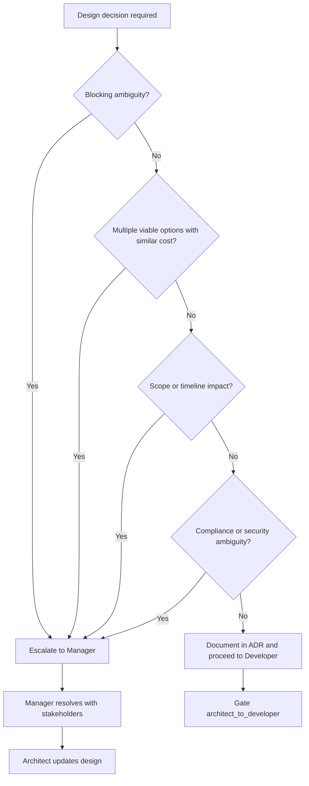

# Architect Decision Tree

When the Architect encounters a design choice that cannot be resolved from requirements alone, use this tree to decide whether to **escalate to Manager** or **proceed to Developer**.

Reference: [20-architect.mdc](../rules/20-architect.mdc), gate `architect_to_manager` in [quality-gates.yaml](quality-gates.yaml).

---

## Decision Flow



---

## Escalate to Manager When

| Situation | Example | Required deliverable |
|-----------|---------|---------------------|
| Conflicting NFRs | p95 &lt;100ms vs full audit logging on every request | Dilemma brief with trade-off matrix |
| Scope/architecture trade-off | Monolith now vs microservices for future scale | Options with cost, timeline, risk |
| Unresolved stakeholder choice | Self-serve signup vs sales-assisted only | Decision needed before API design |
| Compliance ambiguity | GDPR retention period not specified for order history | Manager confirms with legal/sponsor |
| Two+ viable stacks, no clear winner | Postgres vs Mongo for mixed document queries | Weighted scorecard (see architect RULE) |
| Budget or licensing blocker | Commercial license required for chosen middleware | Cost estimate and alternatives |

### Escalation message template

```markdown
Escalation Architect → Manager
Gate: architect_to_manager
Tier: T2
Dilemma: [one sentence]
Options:
  A) [option] — pros/cons, est. effort
  B) [option] — pros/cons, est. effort
Recommendation: [optional, with rationale]
Blocking: [what cannot proceed until resolved]
Artifacts in progress: [list non-blocked work if any]
```

Manager resolves via stakeholder decision, scope change (SCR), or explicit acceptance of risk. Architect documents outcome in ADR and resumes forward handoff.

---

## Proceed to Developer When

- Design decisions documented (ADR or inline in architecture docs)
- No open **blocking** dilemmas
- Required artifacts for current tier exist and are `status: approved` (or tier exception logged)
- Gate `architect_to_developer` validations pass
- Knowledge transfer scheduled per [knowledge-transfer.md](knowledge-transfer.md)

Non-blocking open questions may proceed with documented assumptions; flag in handoff message.

---

## Non-Escalation Cases

Do **not** escalate to Manager for:

- Standard patterns already in charter (e.g., REST API, PostgreSQL)
- Implementation details inside an approved container boundary
- Library choice within an approved stack (document in ADR if significant)
- Performance tuning after baseline targets are set

These belong in ADRs and direct Developer handoff.

---

## Validation

| Rule | Check |
|------|-------|
| ADT-1 | Every escalation includes at least two options |
| ADT-2 | Manager response recorded before design finalization |
| ADT-3 | Proceed path has no undocumented blocking assumptions |
