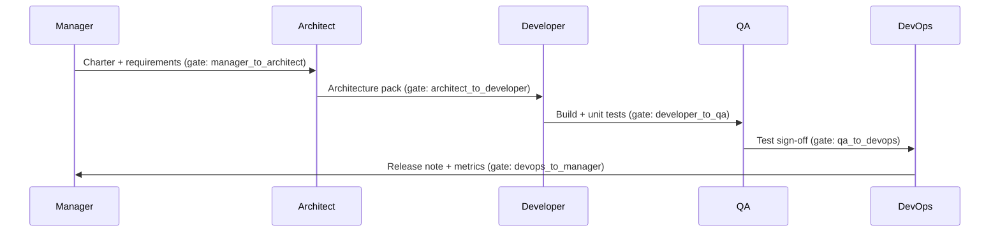

# Agent Communication Protocol

Cross-agent communication standards for async and sync collaboration.

---

## Principles

1. **Artifact-first** — Decisions live in versioned docs, not only chat.
2. **Explicit handoffs** — Use [handoff-procedures.md](handoff-procedures.md) checklists; never assume implicit transfer.
3. **Tier-aware** — Apply full ceremony at T3; reduce at T1 per [scaling-indicators.yaml](scaling-indicators.yaml).
4. **Traceable** — Link messages to doc paths, ticket IDs, and gate transitions.

---

## Message Format

Every substantive agent output should include:

```markdown
## [Agent: Role] — [Action Summary]

**Date:** YYYY-MM-DD  
**Tier:** T1 | T2 | T3  
**Phase:** discovery | design | build | test | release  
**Related artifacts:** [path/to/doc.md](path/to/doc.md)

### Context
One paragraph: what triggered this work.

### Decisions
- Decision 1 — rationale
- Decision 2 — rationale

### Actions / Deliverables
- [ ] Item with owner and due date

### Blockers / Escalations
None | See [escalation-matrix.md](escalation-matrix.md) severity X

### Next agent
Role + handoff gate reference
```

---

## Async vs Sync

| Situation | Channel | Response SLA |
|-----------|---------|--------------|
| Gate failure, P0 bug | Sync + written summary | 1 hour (T3), 4 hours (T1–T2) |
| Design review | Async doc comment + `status: review` | 2 business days |
| Sprint planning | Sync session + updated sprint doc | End of planning day |
| Routine status | Async standup note | Same business day |

---

## Artifact Naming

| Artifact | Pattern | Example |
|----------|---------|---------|
| Architecture doc | `docs/architecture/<slug>/example.md` | Project-specific copy from template |
| Sprint doc | `docs/project-management/sprint-planning/sprint-NN.md` | `sprint-03.md` |
| Test report | `docs/qa/reports/regression-YYYY-MM-DD.md` | Optional folder per project |
| ADR | `docs/architecture/decisions/NNNN-title.md` | `0001-use-postgresql.md` |

---

## Communication Between Agents



---

## Stakeholder Communication (Manager-owned)

Templates in [Manager playbook](../agents/manager/RULE.md#stakeholder-communication-templates):

- **Weekly status** — Progress, risks, next milestone
- **Scope change request** — Impact on timeline, cost, quality
- **Go/no-go release** — QA + DevOps sign-off summary

---

## Documentation Standards Reference

All written artifacts follow [docs/STANDARD.md](../../docs/STANDARD.md): frontmatter, versioning, approval workflow.

---

## Validation

Communication is complete when:

- [ ] Every decision references a doc path or ticket
- [ ] Handoff recipient acknowledged in writing
- [ ] Escalations use [escalation-matrix.md](escalation-matrix.md) severity levels
- [ ] No blocking questions unanswered &gt; SLA
