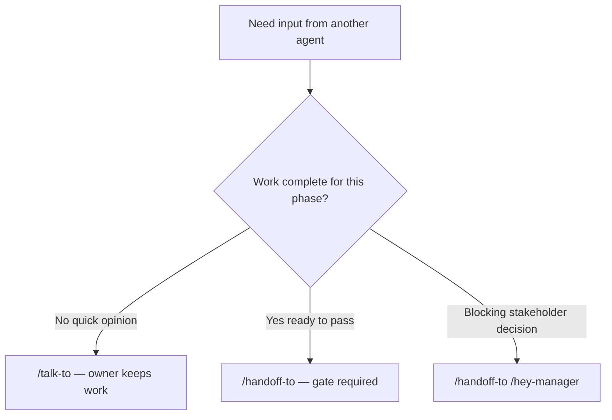

# Consultation Protocol

How agents consult each other without transferring ownership. CALEW command: `/talk-to`.

Reference: [calew-talk-to/SKILL.md](../skills/calew-talk-to/SKILL.md), [communication-protocol.md](communication-protocol.md)

---

## Purpose

Consultation answers "what do you think?" without passing work. The **owner** agent keeps `active_agent` in [session/state.yaml](../session/state.yaml).

---

## Grammar

```
/hey-{owner} /talk-to /hey-{consultant} [question]
```

Examples:

```
/hey-developer /talk-to /hey-architect Should I cache this query?
/hey-architect /talk-to /hey-devops Can we run Redis on our VPS tier?
/hey-qa /talk-to /hey-developer Is this failure a test bug or app bug?
```

---

## Rules

| Rule | Detail |
|------|--------|
| C1 | Owner retains `active_agent`; consultant does not take over |
| C2 | Output tagged `[CONSULTATION — not a handoff]` |
| C3 | Consultations do not satisfy quality gates |
| C4 | `current_gate` unchanged during consultation |
| C5 | Decisions from consultation recorded by owner in versioned docs if significant |
| C6 | Chain consultations via `consultation_stack` in state; clear on handoff |

---

## Consultation vs Handoff vs Escalation



| Type | Ownership | Gate | Example |
|------|-----------|------|---------|
| Consultation | Unchanged | None | "REST or GraphQL?" |
| Handoff | Transfers | Required | Developer → QA |
| Escalation | Transfers to Manager | `architect_to_manager` | Stack choice blocked |

---

## Output Template

```markdown
[CONSULTATION — not a handoff]

**Owner:** {role}
**Consultant:** {role}
**Date:** YYYY-MM-DD

### Question
{user question}

### Consultant opinion
{recommendation with rationale and trade-offs}

### Owner next step
Owner decides and continues. No gate change.
```

---

## Common Consultation Pairs

| Owner | Consultant | Typical question |
|-------|------------|------------------|
| Developer | Architect | Design pattern, API shape, data model |
| Developer | QA | Testability, edge cases |
| Architect | DevOps | Infra constraints, deployment topology |
| Architect | Manager | Scope impact (non-blocking) |
| QA | Developer | Repro steps, expected behavior |
| DevOps | Architect | Runtime requirements, scaling |

---

## Anti-Patterns

- Using `/talk-to` to skip gate validation before handoff
- Consultant making changes to code/docs without owner request
- Treating consultation output as approved architecture (record in ADR if adopted)
- Changing `active_agent` during consultation
