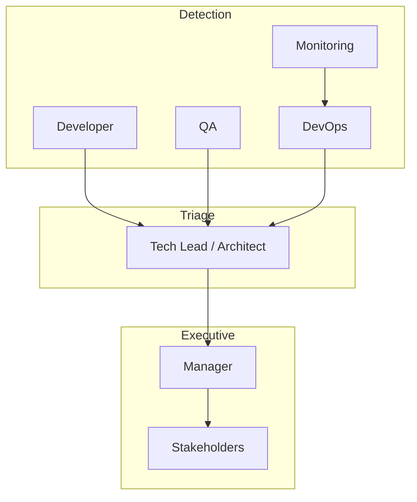

# Error Escalation Matrix

Severity classification, response times, and escalation paths across agents.

---

## Severity Definitions

| Level | Name | Definition | Example |
|-------|------|------------|---------|
| P0 | Critical | Production down; data loss; security breach active | Database corruption; auth bypass |
| P1 | High | Major feature broken; release blocker; no workaround | Payment flow fails for all users |
| P2 | Medium | Degraded function; workaround exists | Report export slow; UI glitch on edge case |
| P3 | Low | Minor; cosmetic; backlog | Typo; nice-to-have enhancement |

---

## Response Matrix

| Severity | Initial response | Resolution target | Escalate to |
|----------|------------------|-------------------|-------------|
| P0 | 15 min | 4 hours | DevOps → Architect → Manager → Executive |
| P1 | 1 hour | 24 hours | QA/Dev → DevOps → Manager |
| P2 | 4 hours | 5 business days | Developer lead → Manager |
| P3 | 1 business day | Next sprint | Backlog owner |

*T3 enterprise: halve response times. T1: P0 still 15 min response; resolution targets may extend with documented risk acceptance.*

---

## Escalation by Agent



| From | Condition | Escalate to | Action |
|------|-----------|-------------|--------|
| Developer | Cannot fix P1 within SLA | Architect | Design flaw or missing requirement |
| Developer | Security vulnerability found | Architect + QA | Threat assessment |
| QA | P0/P1 in production candidate | DevOps + Manager | Hold release |
| Architect | NFR cannot be met | Manager | Scope/timeline tradeoff |
| DevOps | Deploy failure twice | Architect + Developer | Rollback + root cause |
| Manager | Stakeholder dispute on priority | Product owner / sponsor | Charter amendment |

---

## Communication Templates

### P0 Incident (immediate)

```markdown
P0 INCIDENT — [Short title]
Time detected: [UTC]
Impact: [users/systems/data]
Current status: investigating | mitigating | resolved
Incident commander: [role]
Next update: [time]
```

### Escalation request

```markdown
Escalation — P[0-3] — [Title]
Reporter: [agent/role]
Attempted: [actions taken]
Blocker: [why current owner cannot resolve]
Requested from: [role]
Decision needed by: [date/time]
```

---

## Gate Failures

Quality gate failure is **P1** for release path, **P2** for non-release sprints.

| Failed gate | Owner | Escalation if unresolved 24h |
|-------------|-------|------------------------------|
| developer_to_qa | Developer | Architect (design) or Manager (scope) |
| qa_to_devops | QA + Developer | Manager |
| architect_to_developer | Architect | Manager (requirements) |

Reference: [quality-gates.yaml](quality-gates.yaml)

---

## Post-Incident

Within 5 business days (P0/P1):

- [ ] Blameless postmortem doc
- [ ] Action items with owners
- [ ] Update runbooks / [knowledge-transfer.md](knowledge-transfer.md)
- [ ] Gate or checklist update if systemic gap

---

## Validation

- [ ] Every open P0/P1 has assigned incident commander
- [ ] Stakeholders notified for P0/P1 per [communication-protocol.md](communication-protocol.md)
- [ ] Escalation logged with timestamp
