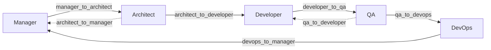

# Agent Handoff Procedures

Checklists for each agent transition. All gates must pass per [quality-gates.yaml](quality-gates.yaml) before handoff.

---

## Handoff Flow



---

## Manager → Architect

**Trigger:** Project charter approved; requirements baseline set.

### Manager delivers

- [ ] [Project charter](../../docs/project-management/project-charter/) — `status: approved`
- [ ] [Work breakdown structure](../../docs/project-management/work-breakdown/) — `status: approved`
- [ ] [Risk assessment](../../docs/project-management/risk-assessment/) — initial matrix
- [ ] [Glossary](../../docs/project-management/glossary/) — domain terms v1
- [ ] Requirements traceability (user stories or REQ-IDs mapped to acceptance criteria)
- [ ] Tier classification (T1/T2/T3) documented
- [ ] [Stakeholder map](../../docs/project-management/stakeholder-map/) — T2+ only

### Architect accepts when

- [ ] No ambiguous must-have requirements
- [ ] Non-functional requirements stated (performance, security, availability)
- [ ] Gate `manager_to_architect` passes in quality-gates.yaml

### Handoff message template

```markdown
Handoff Manager → Architect
Tier: T2
Charter: docs/project-management/project-charter/example.md (replace with project copy)
Open questions: [list or none]
Target: system-context + container diagrams draft by [date]
```

---

## Architect → Manager (Escalation)

**Trigger:** Blocking design dilemma per [architect-decision-tree.md](architect-decision-tree.md).

### Architect delivers

- [ ] Dilemma brief (one paragraph)
- [ ] At least two options with pros, cons, estimated effort
- [ ] Optional recommendation with rationale
- [ ] List of blocked vs in-progress artifacts

### Manager accepts when

- [ ] Stakeholder or sponsor available to decide within SLA
- [ ] Gate `architect_to_manager` informational checklist complete

### Resolution

Manager records decision → Architect updates ADR/design → resumes `architect_to_developer` when ready.

---

## Architect → Developer

**Trigger:** Architecture baseline approved for current sprint scope; no blocking dilemmas.

### Architect delivers

- [ ] [System context](../../docs/architecture/system-context/) — approved
- [ ] [Container diagram](../../docs/architecture/container/) — approved
- [ ] [Component diagram](../../docs/architecture/component/) — T2+ approved
- [ ] [API contract draft](../../docs/data/api-contract/) — OpenAPI for in-scope endpoints
- [ ] [Entity relationship](../../docs/data/entity-relationship/) — approved
- [ ] [Security architecture](../../docs/architecture/security/) — T2+ approved
- [ ] [Deployment overview](../../docs/architecture/deployment/) — approved
- [ ] ADRs for major decisions (optional folder)

### Developer accepts when

- [ ] API contracts match user stories in scope
- [ ] Data model supports acceptance criteria
- [ ] Gate `architect_to_developer` passes

---

## Developer → QA

**Trigger:** Feature complete for sprint; code merged to integration branch.

### Developer delivers

- [ ] Feature branch merged; CI green
- [ ] Unit tests per coverage threshold (tier-specific)
- [ ] Lint/static analysis: zero blocking issues
- [ ] Inline/API docs updated for changed surfaces
- [ ] [Code review checklist](../../docs/process/code-review/) completed for PR
- [ ] Release notes draft for QA scope
- [ ] Known limitations documented

### QA accepts when

- [ ] Test environment deployable (DevOps notified)
- [ ] [Test strategy](../agents/qa/RULE.md#test-strategy) inputs available
- [ ] Gate `developer_to_qa` passes

---

## QA → Developer (Failure Path)

**Trigger:** P0/P1 test failure, acceptance criteria miss, or P1 regression.

### QA delivers

- [ ] Bug report per [qa/RULE.md](../agents/qa/RULE.md) template for each blocking defect
- [ ] Failed test case IDs and environment state
- [ ] REQ-ID linkage for traceability

### Developer accepts when

- [ ] Repro confirmed or clarification requested within 4h (T2+)
- [ ] Gate `qa_to_developer` checklist complete

### Re-handoff

After fix: Developer re-triggers `developer_to_qa` with fix notes and regression test evidence.

---

## QA → DevOps

**Trigger:** Test cycle complete; release candidate tagged; zero open P0/P1.

### QA delivers

- [ ] Test execution report (pass/fail by area)
- [ ] Regression suite result — no open P0/P1
- [ ] [Security testing checklist](../agents/qa/RULE.md#security-testing-checklist) — completed
- [ ] UAT sign-off — T2+ formal; T1 email OK
- [ ] Performance test summary — if NFRs require
- [ ] Open defects with severity and workaround

### DevOps accepts when

- [ ] Rollback plan documented
- [ ] Config/secrets checklist complete
- [ ] Gate `qa_to_devops` passes

---

## DevOps → Manager

**Trigger:** Production or staged release complete.

### DevOps delivers

- [ ] Deployment record (version, time, environment)
- [ ] Monitoring dashboards linked
- [ ] Incident runbook updated if new services
- [ ] Backup verification — T3
- [ ] Post-deploy smoke test results

### Manager accepts when

- [ ] Stakeholder comms sent
- [ ] Sprint/release retrospective scheduled
- [ ] Gate `devops_to_manager` passes

---

## Rollback Handoff (Any → DevOps)

On failed gate or production incident:

1. Declare severity per [escalation-matrix.md](escalation-matrix.md)
2. DevOps executes [rollback strategy](../agents/devops/RULE.md#deployment-rollback-strategies)
3. Manager notifies stakeholders within SLA
4. Root cause doc opened before re-handoff

---

## Validation Rules

| Rule | Check |
|------|-------|
| H1 | Every checkbox item has owner name or role |
| H2 | All referenced docs exist and `status: approved` (or tier exception logged) |
| H3 | Quality gate YAML validates programmatically |
| H4 | Handoff timestamp recorded in sprint or release doc |

---

## Success Criteria

Handoff succeeds when receiving agent confirms acceptance in writing and begins next-phase work without blocking unknowns.
