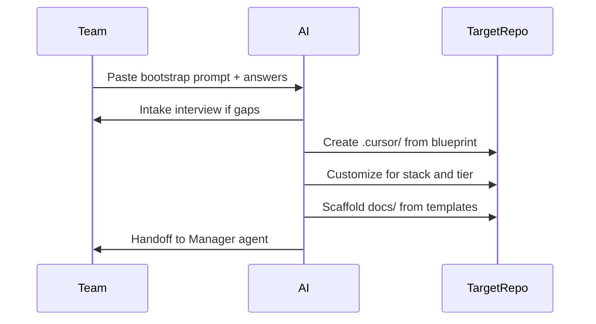

# AI Bootstrap Guide

Use this document to generate a tailored `.cursor/` configuration and project scaffold in a **new repository**. Designed for Cursor Agent or Plan mode.

**Blueprint source:** [project-workflow](.) repository v1.0.0  
**Related:** [HELP.md](HELP.md), [docs/STANDARD.md](docs/STANDARD.md)

---

## Bootstrap Flow



---

## Intake Checklist

Collect these before generating. Ask the team for any missing items.

| # | Question | Used for |
|---|----------|----------|
| 1 | Project name and one-line description | Replace "Acme Platform" references |
| 2 | Domain / industry | Glossary, examples |
| 3 | Team size and timeline | Tier detection (T1/T2/T3) |
| 4 | Compliance needs (GDPR, HIPAA, SOC2, none) | Tier bump, security docs |
| 5 | Primary language and framework | Optional stack rule |
| 6 | Database and cache preferences | Architecture examples |
| 7 | Cloud / deployment target (local, VPS, AWS, GCP, K8s) | Deployment diagram |
| 8 | Testing tools (pytest, jest, playwright, etc.) | QA playbook notes |
| 9 | Existing requirements or diagrams | Skip redundant charter sections |

### Tier detection

Apply [scaling-indicators.yaml](.cursor/workflow/scaling-indicators.yaml):

- **T1:** 1–3 devs, single deployable, &lt;3 months, no compliance
- **T2:** 4–10 devs, multiple services, or formal UAT needed
- **T3:** 10+ devs, regulated industry, or strict SLA/compliance

Document chosen tier and rationale in project charter.

---

## AI Generation Steps

Execute in order:

### Step 1 — Copy `.cursor/` structure

Copy from blueprint to target repo:

```
.cursor/
├── INDEX.md
├── rules/
│   ├── 00-cross-agent.mdc      # alwaysApply: true
│   ├── 10-manager.mdc
│   ├── 20-architect.mdc
│   ├── 30-developer.mdc
│   ├── 40-qa.mdc
│   └── 50-devops.mdc
├── agents/
│   ├── README.md
│   ├── manager/RULE.md
│   ├── architect/RULE.md
│   ├── developer/RULE.md
│   ├── qa/RULE.md
│   └── devops/RULE.md
└── workflow/
    ├── communication-protocol.md
    ├── handoff-procedures.md
    ├── escalation-matrix.md
    ├── knowledge-transfer.md
    ├── architect-decision-tree.md
    ├── quality-gates.yaml
    └── scaling-indicators.yaml
```

### Step 2 — Customize project identity

- Replace all `Acme Platform` / `Acme` with project name
- Update `.cursor/INDEX.md` and `agents/README.md` reference project
- Set tier override in `scaling-indicators.yaml`:

```yaml
project_override:
  name: "Your Project"
  tier: T2
  detected: "2026-06-20"
  rationale: "4 devs, 2 services, B2B SaaS"
```

### Step 3 — Add stack-specific rule (optional)

If team uses a specific stack, create `.cursor/rules/31-<stack>.mdc`:

```markdown
---
description: Project stack conventions — Python/FastAPI
globs: "**/*.py"
alwaysApply: false
---

# Python / FastAPI Conventions

- Use type hints; pydantic v2 for schemas
- pytest + httpx for API tests
- ruff for lint; line length 100
```

Common examples: `31-python.mdc`, `32-typescript.mdc`, `33-go.mdc`

### Step 4 — Scaffold `docs/` for tier

Copy templates from blueprint `docs/` for tier-appropriate bundles. Minimum by tier:

| Tier | Required doc bundles |
|------|---------------------|
| T1 | project-charter, glossary, risk-assessment, system-context, container, deployment, entity-relationship, api-contract, sprint-planning |
| T2 | T1 + component, network, security, data-flow, stakeholder-map, code-review, release-process |
| T3 | All bundles in [docs/INDEX.md](docs/INDEX.md) |

Start from `template.md` files; do not copy `example.md` verbatim — adapt to project domain.

### Step 5 — Initialize repository

```bash
git init
git add .
git commit -m "chore: bootstrap agentic workflow from project-workflow blueprint"
```

### Step 6 — First agent session

Hand off to Manager:

```
@10-manager Initialize this project using the charter template.
Tier: [T1/T2/T3]
Domain: [description]
Success metrics: [list]
```

---

## Copy-Paste Bootstrap Prompt

Paste into Cursor Agent mode when starting a new project:

```
You are bootstrapping a new software project using the project-workflow blueprint.

Read BOOTSTRAP.md from the blueprint repository (or the attached copy).

INTAKE ANSWERS:
- Project name: [NAME]
- Description: [ONE LINE]
- Team size: [N]
- Timeline: [MONTHS]
- Compliance: [NONE/GDPR/etc]
- Stack: [language, framework, DB, cloud]
- Deployment: [local/VPS/K8s/etc]
- Testing: [tools]

TASKS:
1. Create .cursor/ with all rules, playbooks, and workflow files from the blueprint
2. Replace Acme Platform with [NAME] in customized files
3. Set tier in scaling-indicators.yaml with rationale
4. Add optional stack rule if stack specified
5. Scaffold docs/ folders from templates for the detected tier
6. Create initial project-charter draft from template
7. Report completion and invoke @10-manager for next steps

Do not leave TODO or TBD in any file marked status: approved.
Follow docs/STANDARD.md for frontmatter on all docs.
```

---

## Validation Before Complete

- [ ] All 7 gate keys present in quality-gates.yaml and handoff-procedures.md
- [ ] `00-cross-agent.mdc` has `alwaysApply: true`
- [ ] Tier documented with rationale
- [ ] At least charter template exists in docs/
- [ ] HELP.md or pointer created in target repo README
- [ ] No secrets or credentials in generated files

---

## Troubleshooting

| Issue | Fix |
|-------|-----|
| Rules not loading | Ensure `.cursor/rules/*.mdc` exist; restart Cursor |
| Wrong tier ceremony | Re-run scaling-indicators; log exception in sprint notes |
| Agent confused about handoff | Point to HELP.md lifecycle diagram |
| Too many docs for T1 | Apply skip list in scaling-indicators.yaml |
