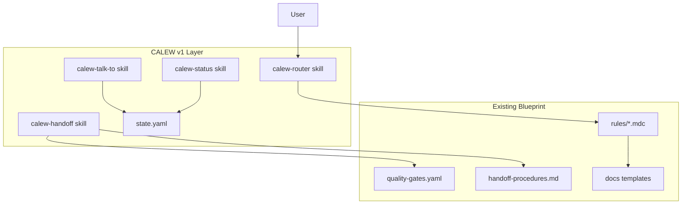

# CALEW Architecture

**CALEW** — Command And Language for Engineering Workflows  
**Version:** 1.2.0  
**Date:** 2026-06-20  
**Audience:** Technical leads and AIs implementing or bootstrapping agentic workflows

CALEW is an **orchestration UX layer** on the [project-workflow](.) blueprint. It does not replace agent rules, quality gates, or documentation templates — it makes them teachable via commands, session state, and consultation protocol.

---

## Philosophy (v1)

CALEW v1 is **rules-based intelligence**:

- Structured decision trees and gate validation
- Explicit handoffs with checklists
- Session awareness via `state.yaml`
- Questions only at defined escalation triggers

CALEW v1 is **not**:

- Auto-pilot autonomous execution
- ML-based risk prediction
- Cross-project learning without file-backed retrospectives
- Native Cursor slash-command registration

---

## System Architecture



---

## Agent Roles

Five agents. QA absorbs Tester as execute-only mode — no sixth persona.

| Role | CALEW | Cursor rule | Phase |
|------|-------|-------------|-------|
| Manager | `/hey-manager` | `@10-manager` | discovery |
| Architect | `/hey-architect` | `@20-architect` | design |
| Developer | `/hey-developer` | `@30-developer` | build |
| QA | `/hey-qa` | `@40-qa` | test |
| Tester alias | `/hey-tester` | `@40-qa` execute_only | test |
| DevOps | `/hey-devops` | `@50-devops` | release |

---

## Three Interaction Types

| Type | Command | Ownership |
|------|---------|-----------|
| Invoke | `/hey-{agent}` | Transfers to agent |
| Consult | `/talk-to` | Unchanged — owner keeps work |
| Transfer | `/handoff-to` | Transfers after gate pass |

Default when lost: `/hey-manager`.

---

## Command Grammar

```bash
# Invoke
/hey-{agent} [skill] [task description]

# Consult (no ownership change)
/hey-{owner} /talk-to /hey-{consultant} [question]

# Handoff (gate required)
/hey-{from} /handoff-to /hey-{to} [gate_key]

# Session
/calew-status
/calew-reset
/gate-check [gate_key]
/make-report on|off
```

Typo aliases (e.g. `/hey-maanger`) resolve to Manager per [calew-router](.cursor/skills/calew-router/SKILL.md).

---

## Session Model

File: [`.cursor/session/state.yaml`](.cursor/session/state.yaml)

| Field | Purpose |
|-------|---------|
| `active_agent` | Current owner |
| `active_mode` | `default` or `execute_only` (tester) |
| `workflow_phase` | discovery / design / build / test / release |
| `current_gate` | Pending or last validated gate |
| `modes.reporting` | Structured progress blocks |
| `consultation_stack` | Active `/talk-to` chain |
| `last_handoff` | Audit trail |

Updated on invoke, handoff, and mode change. Read by `/calew-status`.

---

## Quality Gates

Gates defined in [quality-gates.yaml](.cursor/workflow/quality-gates.yaml). Handoff checklists in [handoff-procedures.md](.cursor/workflow/handoff-procedures.md).

| Gate | Transition |
|------|------------|
| `manager_to_architect` | Manager → Architect |
| `architect_to_manager` | Architect → Manager (escalation) |
| `architect_to_developer` | Architect → Developer |
| `developer_to_qa` | Developer → QA |
| `qa_to_developer` | QA → Developer (fail) |
| `qa_to_devops` | QA → DevOps |
| `devops_to_manager` | DevOps → Manager |

Validate manually via `/gate-check` or `python scripts/gate-check.py <gate>`.

---

## Question Protocol (v1)

Ask user only when:

1. Architectural dilemma → `/escalate-to-manager`
2. Unclear requirement → Manager clarifies
3. Schedule/scope risk → Manager presents options
4. First-time technology → ADR + confirm
5. Budget/cost → Manager decision

Otherwise proceed using existing rules and templates.

---

## Safety Rules

- Never auto-handoff without `/handoff-to`
- Never skip gates before `qa_to_devops`
- Production deploy requires human approval ([project.yaml](.cursor/config/project.yaml))
- Consultation does not satisfy gates
- When unsure: `/hey-manager`

---

## File Structure

```
.cursor/
├── config/
│   └── project.yaml          # Team overrides
├── session/
│   └── state.yaml            # Session state
├── skills/
│   ├── calew-router/
│   ├── calew-talk-to/
│   ├── calew-handoff/
│   └── calew-status/
├── rules/
│   ├── 00-cross-agent.mdc    # CALEW + cross-agent
│   └── 10-50 *.mdc           # Per-agent CALEW commands
└── workflow/
    ├── consultation-protocol.md
    ├── quality-gates.yaml
    └── handoff-procedures.md

SKILLS.md                     # Human cheat sheet
CALEW_ARCHITECTURE.md         # This file
scripts/gate-check.py         # Optional gate validation
```

---

## Compatibility Matrix

| Capability | Cursor Rules | Skills | Hooks | CI / Scripts |
|------------|-------------|--------|-------|--------------|
| Persona switch | Yes | Yes | No | No |
| Command aliases | Yes | Yes | No | No |
| Session state | Partial | Yes | Possible | No |
| Gate file check | Partial | Yes | Yes | Yes |
| Coverage from CI | No | Partial | No | Yes |
| Deploy | No | Partial | No | Yes |

---

## Future / v2 (Deferred)

- `learning-db.yaml` — manual sprint retrospective updates
- Auto-pilot mode with safety boundaries
- Consultative mode (options before every major decision)
- Full autonomous reporting loop
- Risk prediction and resource optimization
- Native slash-command registration if Cursor adds support

---

## Related

- [SKILLS.md](SKILLS.md) — quick reference
- [HELP.md](HELP.md) — lifecycle and diagrams
- [BOOTSTRAP.md](BOOTSTRAP.md) — AI project setup
- [.cursor/INDEX.md](.cursor/INDEX.md) — navigable map
