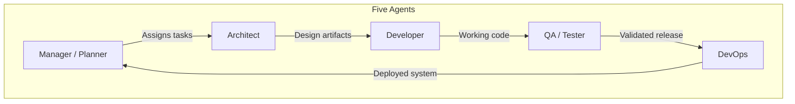
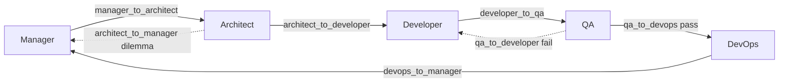

# Agentic Workflow — Help Guide

**Blueprint version:** 1.2.0  
**Date:** 2026-06-20  
**Audience:** Teams and AIs setting up agentic/loop engineering with Cursor

This repository is a **blueprint** for multi-agent software development. Five specialized agents work in sequence with explicit handoffs, quality gates, and reverse loops when work fails or needs escalation.

**CALEW orchestration:** Use [SKILLS.md](SKILLS.md) for command cheat sheet (`/hey-manager`, `/talk-to`, `/handoff-to`). Architecture: [CALEW_ARCHITECTURE.md](CALEW_ARCHITECTURE.md).

---

## What This Blueprint Provides

| Pillar | Location | Purpose |
|--------|----------|---------|
| Agent rules | [`.cursor/rules/`](.cursor/rules/) | Executable Cursor rules — invoke with `@10-manager` or `/hey-manager` |
| CALEW skills | [`.cursor/skills/`](.cursor/skills/) | Command routing, consultation, handoff, status |
| Playbooks | [`.cursor/agents/`](.cursor/agents/) | Comprehensive procedures per role |
| Workflow | [`.cursor/workflow/`](.cursor/workflow/) | Handoffs, gates, escalation, communication |
| Documentation | [`docs/`](docs/) | Templates, examples, guides for all deliverables |
| Bootstrap | [`BOOTSTRAP.md`](BOOTSTRAP.md) | AI instructions to generate a tailored setup |

---

## Agent Roles

| Agent | Invoke | CALEW alias | Responsibility | Key outputs |
|-------|--------|-------------|----------------|-------------|
| **Manager** | `@10-manager` | `/hey-manager` | Plans, prioritizes, manages risks and stakeholders | Charter, sprint plan, risk matrix |
| **Architect** | `@20-architect` | `/hey-architect` | Designs system, diagrams, APIs, stack | C4 diagrams, OpenAPI, ERD, ADRs |
| **Developer** | `@30-developer` | `/hey-developer` | Implements features per architecture | Code, unit tests, CI green |
| **QA** | `@40-qa` | `/hey-qa` | Tests application; files bugs or approves release | Test reports, bug reports, UAT sign-off |
| **Tester** | `@40-qa` | `/hey-tester` | Execute existing tests only | Test execution report |
| **DevOps** | `@50-devops` | `/hey-devops` | Deploys, monitors, manages infra | Deployment record, monitoring, rollback |

Cross-agent behavior always applies via [`00-cross-agent.mdc`](.cursor/rules/00-cross-agent.mdc).

---

## Full Lifecycle (with Reverse Loops)

### Forward path

1. **Manager** initializes project, creates charter, hands off to Architect
2. **Architect** creates diagrams and design; hands off to Developer (or escalates dilemmas to Manager)
3. **Developer** writes code and tests; hands off to QA
4. **QA** tests; on pass hands off to DevOps, on fail returns to Developer
5. **DevOps** deploys and monitors; hands off to Manager to close the release loop

### Reverse loops

| Loop | Trigger | Action |
|------|---------|--------|
| Architect → Manager | Blocking design dilemma (conflicting NFRs, stack choice, compliance) | Manager decides with stakeholders; Architect resumes |
| QA → Developer | P0/P1 failure or acceptance criteria miss | Developer fixes; QA re-tests |

Details: [architect-decision-tree.md](.cursor/workflow/architect-decision-tree.md), [handoff-procedures.md](.cursor/workflow/handoff-procedures.md), [consultation-protocol.md](.cursor/workflow/consultation-protocol.md)

---

## CALEW Commands (Orchestration Layer)

CALEW adds teachable commands on top of `@` rule invocation. Full reference: [SKILLS.md](SKILLS.md).

| Interaction | Command | Ownership |
|-------------|---------|-----------|
| Invoke | `/hey-{agent}` | Agent takes work |
| Consult | `/talk-to` | Owner keeps work |
| Transfer | `/handoff-to` | Passes after gate pass |

Session state: [`.cursor/session/state.yaml`](.cursor/session/state.yaml). Check position: `/calew-status`.

---

## How to Work With Each Agent

| You want to… | Invoke | Say / provide | Expect |
|--------------|--------|---------------|--------|
| Start a new project | `@10-manager` | Domain, goals, team size, timeline | Tier classification, charter draft, sprint plan |
| Design the system | `@20-architect` | Approved charter, requirements | C4 diagrams, API contract, ERD |
| Resolve a design trade-off | `@20-architect` then `@10-manager` | Options and constraints | Escalation brief; Manager decision |
| Build a feature | `@30-developer` | Approved architecture, REQ-ID | Code, tests, PR, CI green |
| Fix a failed test | `@30-developer` | QA bug report with repro | Fix branch, regression test |
| Test the release | `@40-qa` | CI-green build, release notes | Test report or bug reports |
| Deploy to server | `@50-devops` | QA-approved RC tag | Deployed env, smoke results, dashboards |
| Close a release | `@10-manager` | DevOps deployment record | Stakeholder comms, retrospective |

---

## Quality Gates at a Glance

| Gate | From → To | Key requirement |
|------|-----------|-----------------|
| `manager_to_architect` | Manager → Architect | Charter, glossary, risk matrix approved |
| `architect_to_manager` | Architect → Manager | Dilemma brief with ≥2 options |
| `architect_to_developer` | Architect → Developer | C4 L1/L2, API, ERD, deployment docs |
| `developer_to_qa` | Developer → QA | CI green, lint 0, coverage met |
| `qa_to_developer` | QA → Developer | Bug report with repro and severity |
| `qa_to_devops` | QA → DevOps | Zero P0/P1, regression pass, UAT (T2+) |
| `devops_to_manager` | DevOps → Manager | Deploy record, smoke pass, monitoring live |

Full thresholds: [quality-gates.yaml](.cursor/workflow/quality-gates.yaml)

---

## Tier Model (T1 / T2 / T3)

| Tier | Typical project | Ceremony |
|------|-----------------|----------|
| **T1** | 1–3 devs, single deployable, &lt;3 months | Minimal: skip component diagram, network, formal UAT |
| **T2** | 4–10 devs, multiple services | Full architecture, security, UAT, regression |
| **T3** | 10+ devs, compliance/regulated | All docs, DR, formal gates, penetration testing |

Detect tier: [scaling-indicators.yaml](.cursor/workflow/scaling-indicators.yaml)

---

## Acme Platform Walkthrough

All examples use **Acme Platform** — a B2B order management SaaS. Trace one feature end-to-end:

1. **Manager** — [work-breakdown/example.md](docs/project-management/work-breakdown/example.md) + [project-charter/example.md](docs/project-management/project-charter/example.md): scope, WBS, success metrics
2. **Architect** — [system-context/example.md](docs/architecture/system-context/example.md) → [entity-relationship/example.md](docs/data/entity-relationship/example.md) → [entity-state/example.md](docs/process/entity-state/example.md) → [api-contract/example.yaml](docs/data/api-contract/example.yaml)
3. **Developer** — Implement `POST /orders` per OpenAPI spec; unit tests ≥ tier coverage
4. **QA** — Execute [user-journey/example.md](docs/ux/user-journey/example.md) scenarios; file bugs or approve RC
5. **DevOps** — Deploy per [deployment/example.md](docs/architecture/deployment/example.md); smoke test; hand back to Manager

---

## Quick Links

| Resource | Path |
|----------|------|
| CALEW commands | [SKILLS.md](SKILLS.md) |
| CALEW architecture | [CALEW_ARCHITECTURE.md](CALEW_ARCHITECTURE.md) |
| Repository README | [README.md](README.md) |
| AI bootstrap | [BOOTSTRAP.md](BOOTSTRAP.md) |
| Cursor index | [.cursor/INDEX.md](.cursor/INDEX.md) |
| Doc catalog | [docs/INDEX.md](docs/INDEX.md) |
| Diagram priorities | [docs/DIAGRAMS.md](docs/DIAGRAMS.md) |
| Agent playbooks | [.cursor/agents/README.md](.cursor/agents/README.md) |
| Communication protocol | [.cursor/workflow/communication-protocol.md](.cursor/workflow/communication-protocol.md) |

---

## Getting Started

**New project with AI:** Open [BOOTSTRAP.md](BOOTSTRAP.md), paste the bootstrap prompt into Cursor Agent mode, answer the intake checklist.

**Existing team onboarding:** Read this file, then invoke `@10-manager` with your project context.

**Rule invocation:** In Cursor chat, type `@10-manager` (or 20, 30, 40, 50) or CALEW alias `/hey-manager` to activate that agent's rule for the session.
