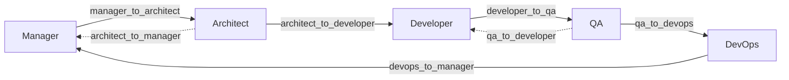

# Project Workflow Blueprint

Production-ready template for multi-agent software development with Cursor AI. Teams use this repository so their AI can generate a tailored `.cursor/` folder with consistent agent rules, quality gates, and documentation standards.

**Blueprint version:** 1.1.0  
**Last updated:** 2026-06-20

---

## Start Here

| Document | Audience | Purpose |
|----------|----------|---------|
| **[HELP.md](HELP.md)** | Humans and AIs | Agent diagrams, lifecycle, how to invoke each role |
| **[BOOTSTRAP.md](BOOTSTRAP.md)** | AIs | Intake checklist and prompt to scaffold a new project |
| **[AGENTS.md](AGENTS.md)** | Cursor | Quick agent reference |

---

## What This Repository Provides

| Pillar | Location | Purpose |
|--------|----------|---------|
| Agent workflow | [`.cursor/`](.cursor/) | Role-based rules (`.mdc`), playbooks, handoffs, quality gates |
| Documentation | [`docs/`](docs/) | Architecture, process, data, UX, and PM templates with examples |
| Standards | [`docs/STANDARD.md`](docs/STANDARD.md) | Metadata, versioning, review workflow for all documents |

---

## Quick Start: New Project (AI Bootstrap)

1. Open [BOOTSTRAP.md](BOOTSTRAP.md) and paste the bootstrap prompt into Cursor Agent mode
2. Answer the intake checklist (project name, tier, stack, deployment)
3. AI generates `.cursor/` and scaffolds tier-appropriate `docs/`
4. Invoke `@10-manager` to create the project charter and plan Sprint 1

**Alternative:** Copy the entire repo and replace Acme examples manually.

---

## Agent Roles

| Agent | Rule file | Playbook | Primary phase |
|-------|-----------|----------|---------------|
| Manager | [10-manager.mdc](.cursor/rules/10-manager.mdc) | [agents/manager/RULE.md](.cursor/agents/manager/RULE.md) | Init, planning, stakeholder comms |
| Architect | [20-architect.mdc](.cursor/rules/20-architect.mdc) | [agents/architect/RULE.md](.cursor/agents/architect/RULE.md) | Design, stack, security architecture |
| Developer | [30-developer.mdc](.cursor/rules/30-developer.mdc) | [agents/developer/RULE.md](.cursor/agents/developer/RULE.md) | Implementation, review, refactor |
| QA | [40-qa.mdc](.cursor/rules/40-qa.mdc) | [agents/qa/RULE.md](.cursor/agents/qa/RULE.md) | Testing, bug triage, UAT |
| DevOps | [50-devops.mdc](.cursor/rules/50-devops.mdc) | [agents/devops/RULE.md](.cursor/agents/devops/RULE.md) | CI/CD, infra, deployment |

Cross-agent rules always apply: [00-cross-agent.mdc](.cursor/rules/00-cross-agent.mdc).

---

## Workflow Overview

Each transition requires passing quality gates in [`.cursor/workflow/quality-gates.yaml`](.cursor/workflow/quality-gates.yaml). Handoff checklists: [handoff-procedures.md](.cursor/workflow/handoff-procedures.md).

---

## Documentation Index

- **Master catalog:** [docs/INDEX.md](docs/INDEX.md)
- **Document relationships:** [docs/RELATIONSHIPS.md](docs/RELATIONSHIPS.md)
- **Writing standard:** [docs/STANDARD.md](docs/STANDARD.md)

Each bundle includes `template.md`, `example.md` (Acme Platform), and `guide.md`.

---

## Scaling: When to Skip Sections

| Tier | Skip or simplify |
|------|------------------|
| T1 | Component C4 L3, formal UAT, 80% coverage (use 60%) |
| T2 | Full core set; optional formal stakeholder map |
| T3 | Nothing mandatory can be skipped |

Details: [scaling-indicators.yaml](.cursor/workflow/scaling-indicators.yaml).

---

## Extending the Blueprint

- **Language-specific rules:** Add `.cursor/rules/31-typescript.mdc` per [BOOTSTRAP.md](BOOTSTRAP.md)
- **CI enforcement:** Wire [quality-gates.yaml](.cursor/workflow/quality-gates.yaml) into your pipeline
- **Custom agents:** Copy an agent folder, add matching `.mdc`, update [`.cursor/INDEX.md`](.cursor/INDEX.md)

---

## License

Use internally across your organization. Adapt ownership fields and tier defaults to your team.
