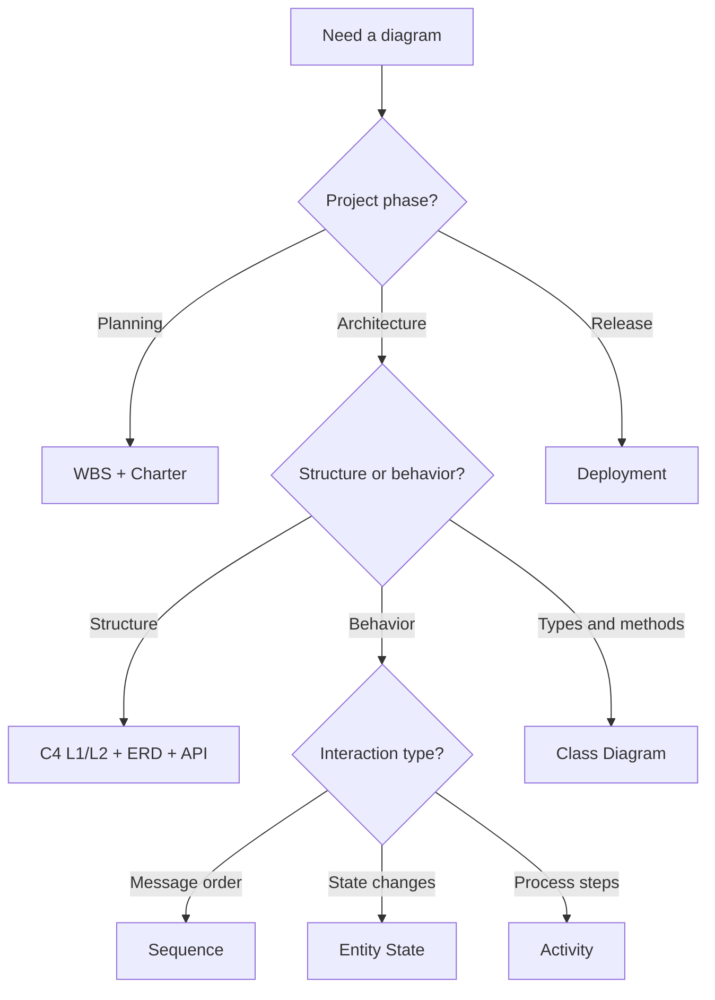

# Diagram Catalog and Priority Guide

Master reference for **which diagram to create, when, and how critical it is** by project tier and phase.

**Blueprint version:** 1.1.0  
**Related:** [INDEX.md](INDEX.md), [STANDARD.md](STANDARD.md), [RELATIONSHIPS.md](RELATIONSHIPS.md)

---

## How to Use This Guide

1. Detect project **tier** (T1/T2/T3) via [scaling-indicators.yaml](../.cursor/workflow/scaling-indicators.yaml)
2. Identify current **phase** (Planning, Architecture, Implementation, Verification, Release)
3. Consult the **priority matrix** below — create **Critical** diagrams before handoff; **Recommended** when they reduce ambiguity; **Optional** when time-constrained
4. Use the **decision flowchart** when unsure which behavior diagram applies

**Legend:** Critical = blocking or high-risk if missing | Recommended = strongly advised | Optional = nice-to-have | Skip = tier exception allowed (log in sprint notes)

---

## Priority Matrix

| Diagram | Bundle | Phase | T1 | T2 | T3 | Owner |
|---------|--------|-------|----|----|-----|-------|
| WBS | [project-management/work-breakdown/](project-management/work-breakdown/) | Planning | **Critical** | **Critical** | **Critical** | Manager |
| Project Charter | [project-management/project-charter/](project-management/project-charter/) | Planning | **Critical** | **Critical** | **Critical** | Manager |
| System Context (C4 L1) | [architecture/system-context/](architecture/system-context/) | Architecture | **Critical** | **Critical** | **Critical** | Architect |
| Container (C4 L2) | [architecture/container/](architecture/container/) | Architecture | **Critical** | **Critical** | **Critical** | Architect |
| ERD | [data/entity-relationship/](data/entity-relationship/) | Architecture | **Critical** | **Critical** | **Critical** | Architect |
| API Contract | [data/api-contract/](data/api-contract/) | Architecture | **Critical** | **Critical** | **Critical** | Architect |
| Deployment | [architecture/deployment/](architecture/deployment/) | Architecture / Release | **Critical** | **Critical** | **Critical** | DevOps |
| Sequence | [process/workflow-sequence/](process/workflow-sequence/) | Architecture / Dev | Recommended | **Critical** | **Critical** | Architect |
| Entity State (ESD) | [process/entity-state/](process/entity-state/) | Architecture | Recommended* | **Critical** | **Critical** | Architect |
| Activity (AD) | [process/activity-diagram/](process/activity-diagram/) | Process | Optional | Recommended | **Critical** | Architect |
| Class Diagram | [data/class-diagram/](data/class-diagram/) | Architecture | Optional | Recommended | **Critical** | Architect |
| Component (C4 L3) | [architecture/component/](architecture/component/) | Architecture | Skip | Recommended | **Critical** | Architect |
| Data Flow (DFD) | [data/data-flow/](data/data-flow/) | Architecture | Skip | Recommended | **Critical** | Architect |
| Network | [architecture/network/](architecture/network/) | Architecture | Skip | Recommended | **Critical** | DevOps |
| Security | [architecture/security/](architecture/security/) | Architecture | Optional | Recommended | **Critical** | Architect |
| User Journey | [ux/user-journey/](ux/user-journey/) | UX | Optional | Recommended | Recommended | Manager |
| Wireframes | [ux/wireframes/](ux/wireframes/) | UX | Optional | Recommended | Recommended | Developer |
| Sprint Planning | [project-management/sprint-planning/](project-management/sprint-planning/) | Planning | **Critical** | **Critical** | **Critical** | Manager |

\*Entity State is **Critical** when the domain has lifecycle states (orders, tickets, payments, approvals). Otherwise Optional at T1.

---

## Decision Flowchart

---

## Diagram Types Explained

| Type | Answers the question | Notation | Example use |
|------|---------------------|----------|-------------|
| **WBS** | What work packages exist? | Tree / mindmap | Decompose Acme Platform into agent phases |
| **C4 L1/L2** | Who uses the system and what runs where? | C4 / Mermaid | System context, containers |
| **ERD** | What entities and relationships persist? | erDiagram | Customer, Order, OrderLine |
| **Class** | What types, methods, and interfaces exist? | classDiagram | OrderService, OrderRepository |
| **Entity State** | What states can an entity be in? | stateDiagram-v2 | Order: PENDING → SHIPPED |
| **Sequence** | Who sends what message in what order? | sequenceDiagram | Create order API call flow |
| **Activity** | What steps and decisions in a process? | flowchart | Fulfillment with inventory branch |
| **DFD** | How does data move between processes? | flowchart | Portal → API → DB → ERP |
| **Deployment** | Where does software run? | flowchart | EKS, RDS, CloudFront |

---

## Diagram Pairs (use together)

| Pair | Why |
|------|-----|
| **ERD + Class** | ERD = persistence and cardinality; Class = behavior, methods, interfaces |
| **ERD + Entity State** | ERD defines `status` column; ESD defines allowed transitions and guards |
| **Sequence + API** | Sequence shows runtime flow; OpenAPI defines the contract being exercised |
| **Entity State + Activity** | ESD = entity lifecycle; Activity = operational steps that trigger transitions |
| **WBS + Sprint Planning** | WBS = full decomposition; Sprint = leaf stories for current iteration |
| **Container + Deployment** | Container = logical units; Deployment = physical mapping |

---

## By Agent Phase

| Agent | Critical diagrams | Recommended |
|-------|-------------------|-------------|
| **Manager** | WBS, Charter, Sprint | Project timeline, Stakeholder map (T2+) |
| **Architect** | C4 L1/L2, ERD, API, ESD* | Sequence, Class (T2+), Activity (T2+), Component (T2+) |
| **Developer** | — (implements from above) | Wireframes, Code review checklist |
| **QA** | — | User journey scenarios, Accessibility |
| **DevOps** | Deployment | Network (T2+), Release process |

---

## Acme Platform Trace

End-to-end diagram path for the reference project:

1. [work-breakdown/example.md](project-management/work-breakdown/example.md)
2. [system-context/example.md](architecture/system-context/example.md)
3. [entity-relationship/example.md](data/entity-relationship/example.md) + [class-diagram/example.md](data/class-diagram/example.md)
4. [entity-state/example.md](process/entity-state/example.md)
5. [workflow-sequence/example.md](process/workflow-sequence/example.md) + [api-contract/example.yaml](data/api-contract/example.yaml)
6. [activity-diagram/example.md](process/activity-diagram/example.md)
7. [deployment/example.md](architecture/deployment/example.md)

---

## Related

- Architect playbook: [../.cursor/agents/architect/RULE.md](../.cursor/agents/architect/RULE.md)
- Manager playbook: [../.cursor/agents/manager/RULE.md](../.cursor/agents/manager/RULE.md)
- Gate artifacts: [../.cursor/workflow/quality-gates.yaml](../.cursor/workflow/quality-gates.yaml)
