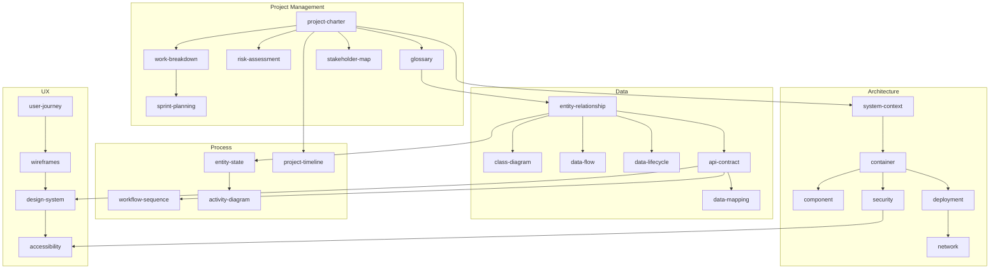

# Documentation Relationships

Dependency graph and agent ownership for blueprint documents.

**Blueprint version:** 1.1.0

---

## Document Dependency Graph

---

## Agent Ownership Matrix

| Document | Primary owner | Secondary | Gate reference |
|----------|---------------|-----------|------------------|
| project-charter | Manager | Architect | manager_to_architect |
| work-breakdown | Manager | Architect | manager_to_architect |
| risk-assessment | Manager | Architect | manager_to_architect |
| glossary | Manager | All | manager_to_architect |
| sprint-planning | Manager | Developer | manager_to_architect |
| stakeholder-map | Manager | Architect | manager_to_architect |
| system-context | Architect | Manager | architect_to_developer |
| container | Architect | DevOps | architect_to_developer |
| component | Architect | Developer | architect_to_developer |
| deployment | DevOps | Architect | architect_to_developer |
| network | DevOps | Architect | qa_to_devops |
| security | Architect | QA, DevOps | qa_to_devops |
| entity-relationship | Architect | Developer | architect_to_developer |
| class-diagram | Architect | Developer | architect_to_developer (recommended T2+) |
| entity-state | Architect | Developer, QA | architect_to_developer (recommended) |
| activity-diagram | Architect | Developer, QA | architect_to_developer (recommended T2+) |
| api-contract | Architect | Developer, QA | architect_to_developer |
| workflow-sequence | Architect | Developer | architect_to_developer (recommended) |
| data-flow | Architect | Developer | architect_to_developer |
| data-mapping | Developer | Architect | developer_to_qa |
| data-lifecycle | Architect | DevOps | architect_to_developer |
| project-timeline | Manager | Architect | manager_to_architect |
| release-process | DevOps | Manager, QA | qa_to_devops |
| incident-response | DevOps | Manager | devops_to_manager |
| change-management | Manager | DevOps | manager_to_architect |
| code-review | Developer | Architect | developer_to_qa |
| user-journey | Manager | QA | qa_to_devops |
| wireframes | Developer | Manager | developer_to_qa |
| design-system | Developer | QA | developer_to_qa |
| accessibility | QA | Developer | qa_to_devops |
| usability-testing | QA | Manager | qa_to_devops |

---

## Gate → Required Documents

| Gate | Minimum documents (T1) | Additional (T2+) |
|------|------------------------|------------------|
| manager_to_architect | charter, WBS, glossary, risk | stakeholder-map |
| architect_to_developer | system-context, container, deployment, ERD, API | component, network, security, data-flow, class, activity |
| developer_to_qa | release notes draft, CI green | code-review checklist |
| qa_to_devops | test report, regression | security checklist, UAT, usability-testing |
| devops_to_manager | deployment record, smoke | monitoring dashboards |

Recommended (non-blocking): entity-state, workflow-sequence at all tiers. See [DIAGRAMS.md](DIAGRAMS.md).

Full thresholds: [../.cursor/workflow/quality-gates.yaml](../.cursor/workflow/quality-gates.yaml)

---

## Acme Platform Trace Path

1. [work-breakdown/example.md](project-management/work-breakdown/example.md)
2. [project-charter/example.md](project-management/project-charter/example.md)
3. [system-context/example.md](architecture/system-context/example.md)
4. [entity-relationship/example.md](data/entity-relationship/example.md) + [class-diagram/example.md](data/class-diagram/example.md)
5. [entity-state/example.md](process/entity-state/example.md)
6. [workflow-sequence/example.md](process/workflow-sequence/example.md) + [api-contract/example.yaml](data/api-contract/example.yaml)
7. [activity-diagram/example.md](process/activity-diagram/example.md)
8. [deployment/example.md](architecture/deployment/example.md)

---

## Related

- [DIAGRAMS.md](DIAGRAMS.md) — Diagram priority matrix
- [INDEX.md](INDEX.md) — Full catalog
- [STANDARD.md](STANDARD.md) — Metadata rules
- [../.cursor/workflow/handoff-procedures.md](../.cursor/workflow/handoff-procedures.md) — Handoff checklists
