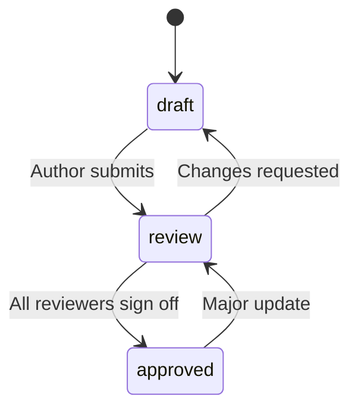

# Blueprint Documentation Standard

Every document in `docs/` and agent playbooks in `.cursor/agents/` must follow this standard for consistency, traceability, and AI readability.

---

## Required Frontmatter

Place YAML frontmatter at the top of every markdown document:

```yaml
---
title: Document Title
version: 1.0.0
created: YYYY-MM-DD
updated: YYYY-MM-DD
owner: role-or-person
reviewers: [architect, devops]
status: draft | review | approved
tags: [category, subtype]
audience: [developers, stakeholders]
tier: T1 | T2 | T3 | all
related:
  - path/to/related-doc.md
---
```

| Field | Required | Description |
|-------|----------|-------------|
| `title` | Yes | Human-readable document name |
| `version` | Yes | Semver for document content (not repo version) |
| `created` | Yes | ISO date first published |
| `updated` | Yes | ISO date last substantive edit |
| `owner` | Yes | Role or person accountable for accuracy |
| `reviewers` | Yes | Roles that must approve before `approved` status |
| `status` | Yes | Workflow state (see below) |
| `tags` | Yes | Search/filter tags |
| `audience` | Yes | Intended readers |
| `tier` | Yes | Minimum project tier requiring this doc, or `all` |
| `related` | Recommended | Cross-links to dependent docs and agent rules |

---

## Status Workflow



| Status | Meaning |
|--------|---------|
| `draft` | Work in progress; not binding for gates |
| `review` | Ready for reviewer feedback |
| `approved` | Satisfies quality gates; may be referenced in handoffs |

---

## Versioning Rules

- **Patch** (1.0.x): Typos, clarifications, diagram label fixes
- **Minor** (1.x.0): New sections, non-breaking diagram updates
- **Major** (x.0.0): Structural changes, removed sections, breaking API/contract changes

Update `updated` on every version bump. Record changes in document revision history section (bottom of doc).

---

## Naming Conventions

| Type | Pattern | Example |
|------|---------|---------|
| Diagram bundle folder | `kebab-case` | `system-context/` |
| Bundle files | `template.md`, `example.md`, `guide.md` | Fixed names |
| Agent playbooks | `RULE.md` | `.cursor/agents/developer/RULE.md` |
| Cursor rules | `NN-role.mdc` | `30-developer.mdc` |
| Config artifacts | `kebab-case.yaml` | `quality-gates.yaml` |

---

## Ownership Matrix

| Document category | Primary owner | Reviewers |
|-------------------|---------------|-----------|
| Architecture | Architect | DevOps, Developer |
| Process | Architect + Manager | QA |
| Data | Architect + Developer | QA |
| UX | Manager + Developer | QA |
| Project management | Manager | Architect, stakeholders |
| Agent playbooks | Respective agent role | Cross-agent lead |

---

## Review and Approval

1. Author sets `status: review` and notifies reviewers listed in frontmatter.
2. Reviewers verify: completeness for tier, cross-links valid, diagrams render, no placeholder text.
3. All reviewers approve → author sets `status: approved` and bumps `version` if needed.
4. Quality gates ([quality-gates.yaml](../.cursor/workflow/quality-gates.yaml)) reference `approved` artifacts only.

---

## Diagram Standards

| Format | Use for | Location |
|--------|---------|----------|
| PlantUML | C4 architecture (L1–L3), deployment | `docs/architecture/` |
| Mermaid | Process, data, network, security | `docs/process/`, `docs/data/`, etc. |
| OpenAPI YAML | API contracts | `docs/data/api-contract/` |
| ASCII | Wireframes, quick sketches | `docs/ux/wireframes/` |

Each diagram bundle must include template stub, filled Acme example, and guide with tool recommendations.

---

## Anti-Patterns (Do Not)

- ❌ Placeholder text: `TODO`, `TBD`, `fill in later` in approved docs
- ❌ Missing frontmatter on new documents
- ❌ Diagrams without legend or version in caption
- ❌ Broken relative links after moves (run link check before approve)

---

## Validation Checklist (Before `approved`)

- [ ] Frontmatter complete and valid
- [ ] Tier tag matches project tier requirements
- [ ] Related links resolve
- [ ] Diagram source renders (Mermaid/PlantUML preview)
- [ ] Example uses project-specific names (not Acme) for production projects
- [ ] Owner and reviewers assigned
