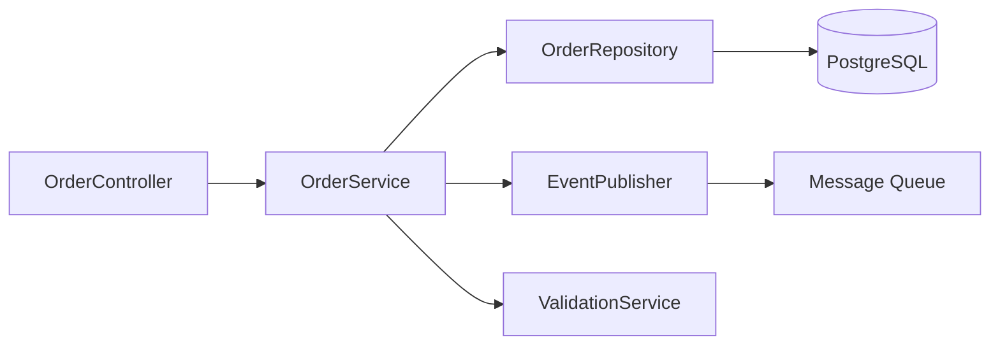

# Component Diagram — Acme Order API

| Component | Responsibility |
|-----------|----------------|
| OrderController | HTTP layer, auth check |
| OrderService | Business rules, transactions |
| OrderRepository | Persistence |
| EventPublisher | Async ERP notifications |
