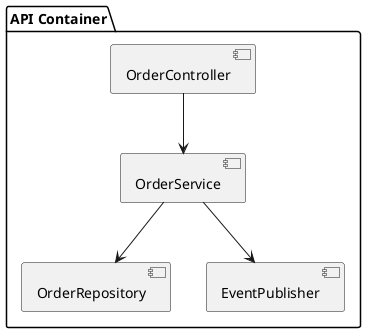

# Component Diagram — Template (C4 Level 3)

Scope one container. List components (modules), interfaces, dependencies.

```plantuml
@startuml
package "API Container" {
  [OrderController] --> [OrderService]
  [OrderService] --> [OrderRepository]
  [OrderService] --> [EventPublisher]
}
@enduml
```
