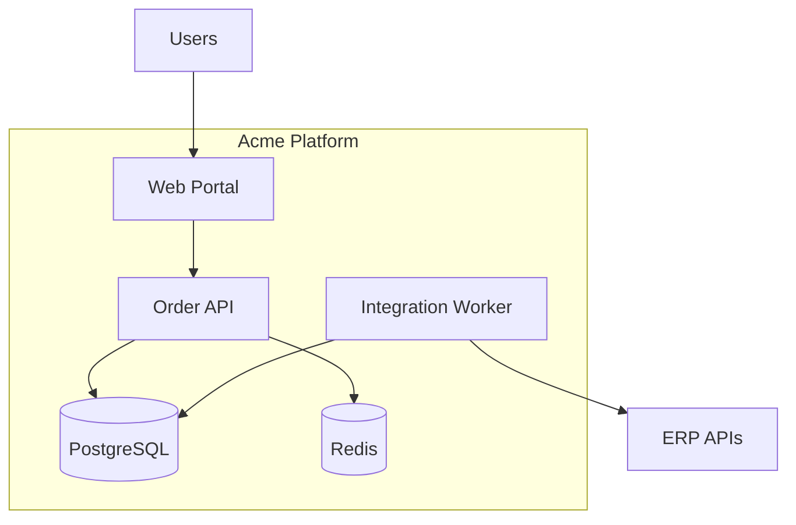

# Container Diagram — Acme Platform

| Container | Technology | Responsibility |
|-----------|------------|----------------|
| Web Portal | SPA | Buyer and ops UI |
| Order API | Stateless service | Orders, catalog, auth |
| Integration Worker | Worker service | ERP sync jobs |
| PostgreSQL | RDBMS | Transactional data |
| Redis | Cache | Sessions, rate limits |

