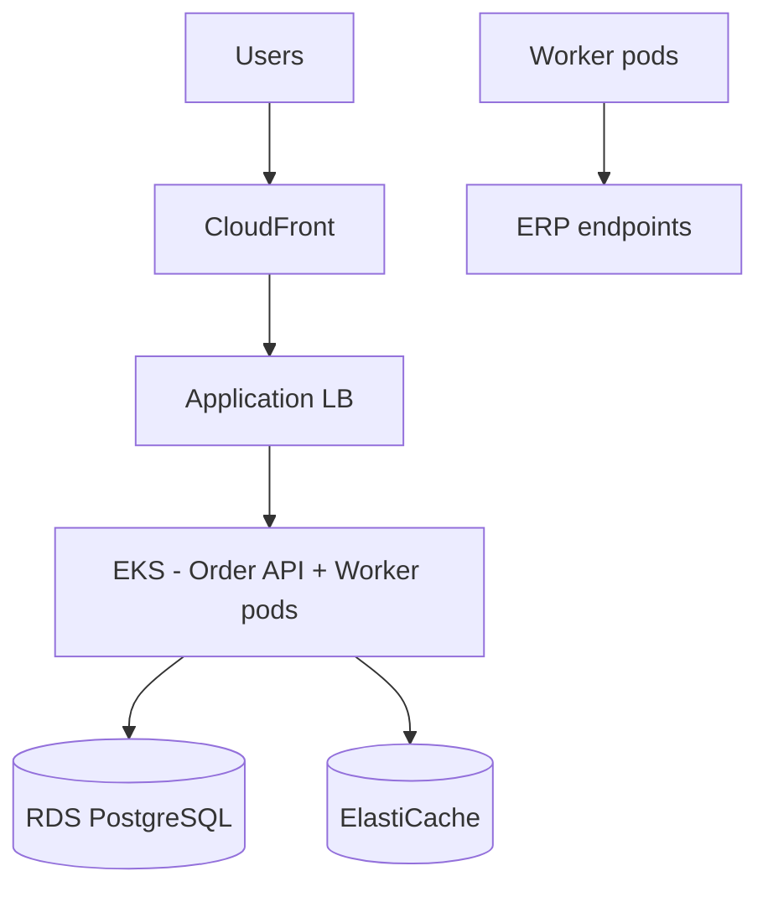

# Deployment Diagram — Acme Platform

Production: AWS eu-west-1, EKS cluster, RDS PostgreSQL Multi-AZ, ElastiCache Redis.

| Env | Cluster | DB |
|-----|---------|-----|
| staging | acme-stg | db.t3.medium |
| prod | acme-prod | db.r6g.large Multi-AZ |
