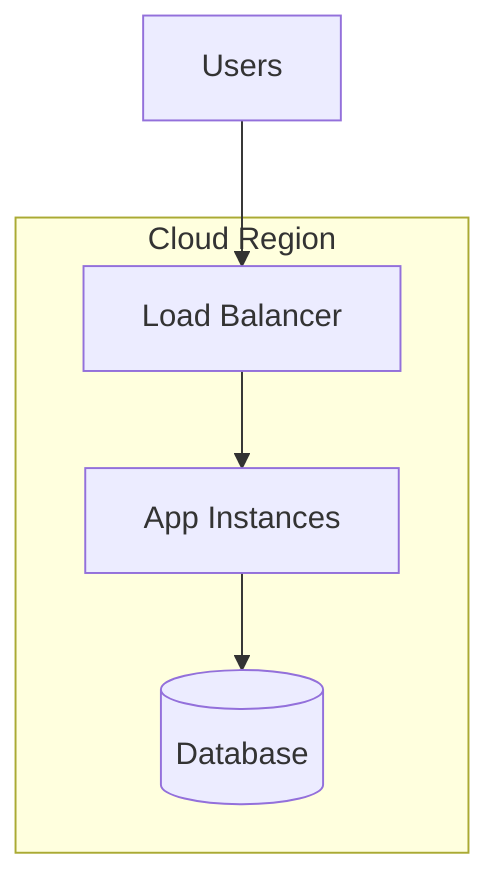

# Deployment Diagram — Template

## Environments
| Env | Purpose | URL pattern |
|-----|---------|-------------|
| dev | | |
| staging | | |
| prod | | |

```mermaid
flowchart TB
  subgraph cloud [Cloud Region]
    LB[Load Balancer] --> App[App Instances]
    App --> DB[(Database)]
  end
  Users[Users] --> LB
```
