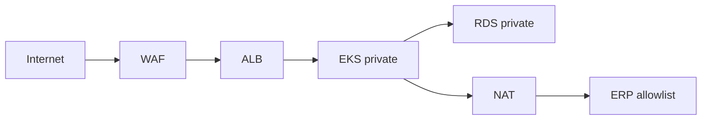

# Network Architecture — Acme Platform

- VPC 10.0.0.0/16
- Public subnets: ALB, NAT
- Private subnets: EKS nodes, RDS, Redis
- WAF on CloudFront; TLS 1.2+ termination at ALB
- Egress to ERP allowlist via NAT gateway

