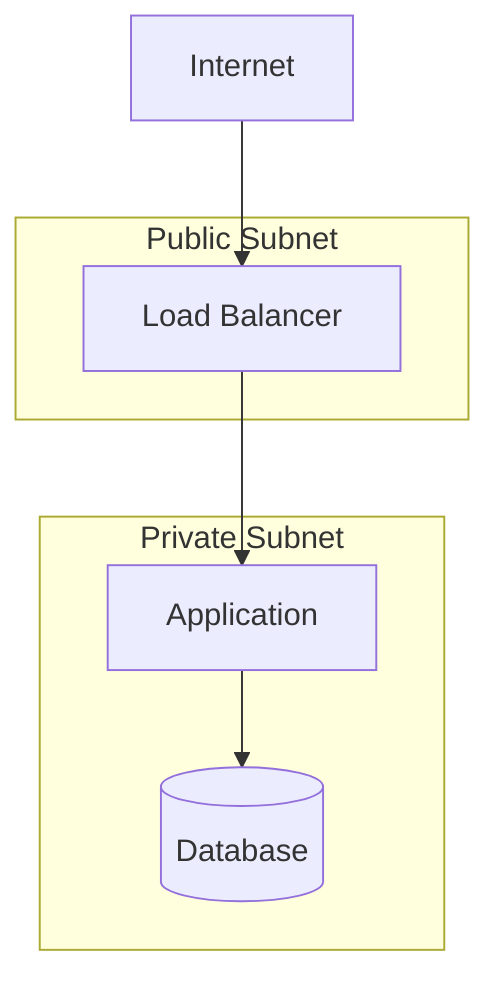

# Network Architecture — Template

Document VPCs, subnets, ingress/egress, firewall rules.

```mermaid
flowchart TB
  subgraph public [Public Subnet]
    LB[Load Balancer]
  end
  subgraph private [Private Subnet]
    App[Application]
    DB[(Database)]
  end
  Internet --> LB --> App --> DB
```
