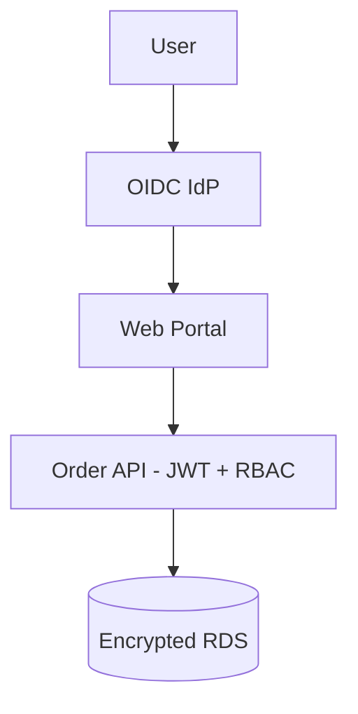

# Security Architecture — Acme Platform

| Control | Implementation |
|---------|----------------|
| AuthN | OIDC via corporate IdP |
| AuthZ | RBAC: buyer, ops, admin |
| Transport | TLS 1.2+ end-to-end |
| Data at rest | RDS encryption, S3 SSE |
| Secrets | AWS Secrets Manager |
| Audit | CloudTrail + app audit log |

STRIDE: ERP webhook tampering mitigated by HMAC signatures and replay window.

