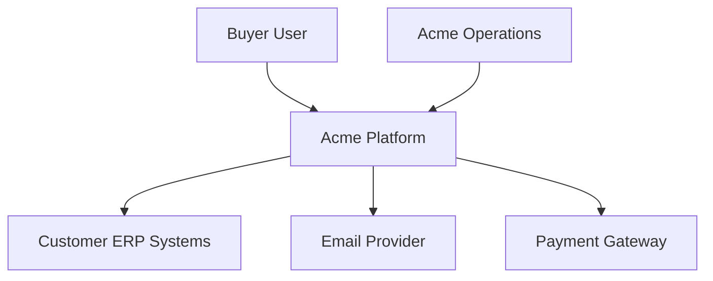

# System Context — Acme Platform

Acme Platform is a B2B order management SaaS connecting buyers, Acme ops, and customer ERP systems.

## Diagram (Mermaid)

## Actors
| Actor | Description |
|-------|-------------|
| Buyer User | Creates and tracks orders via web portal |
| Acme Operations | Manages catalog, fulfillment, support |

## External Systems
| System | Purpose | Protocol |
|--------|---------|----------|
| Customer ERP | Order sync | REST + webhooks |
| Email Provider | Notifications | SMTP/API |
| Payment Gateway | Billing | REST |
