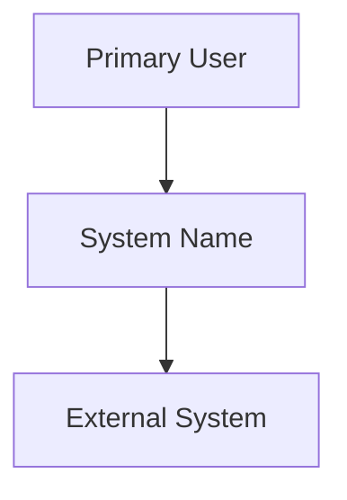

# System Context — Template (C4 Level 1)

## System Name
[Your System Name]

## Purpose
[One paragraph]

## Diagram (PlantUML)

```plantuml
@startuml
!include https://raw.githubusercontent.com/plantuml-stdlib/C4-PlantUML/master/C4_Context.puml
Person(user, "Primary User", "Description")
System(system, "System Name", "Core capability")
System_Ext(ext, "External System", "Integration")
Rel(user, system, "Uses")
Rel(system, ext, "Integrates")
@enduml
```

## Diagram (Mermaid fallback)



## Actors
| Actor | Description |
|-------|-------------|
| | |

## External Systems
| System | Purpose | Protocol |
|--------|---------|----------|
| | | |
