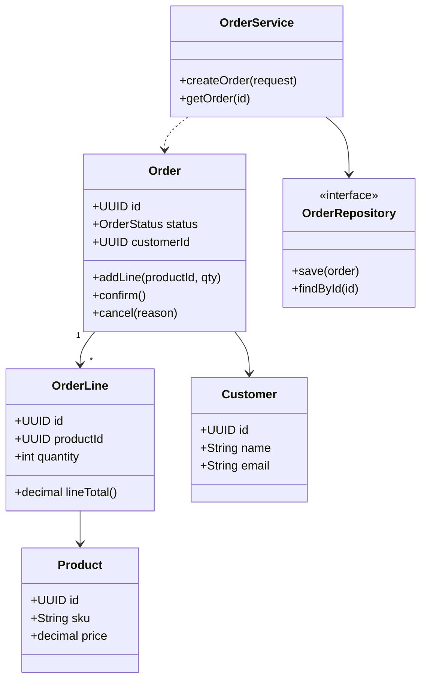

# Class Diagram — Acme Platform

Complements [entity-relationship/example.md](../entity-relationship/example.md).

| Class | Responsibility |
|-------|----------------|
| OrderService | Business rules, transactions |
| OrderRepository | Persistence port |
| Order | Aggregate root with lifecycle |
