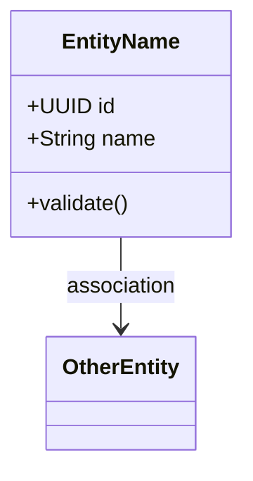

# Class Diagram — Template

Domain types with attributes, methods, and relationships. Complements ERD — not a duplicate.

```mermaid
classDiagram
  class EntityName {
    +UUID id
    +String name
    +validate()
  }
  EntityName --> OtherEntity : association
```
