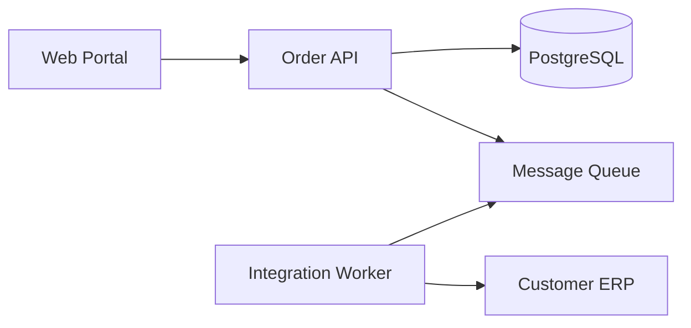

# Data Flow — Acme Platform

```mermaid
flowchart LR
  Portal[Web Portal] --> API[Order API]
  API --> PG[(PostgreSQL)]
  API --> Q[Message Queue]
  Worker[Integration Worker] --> Q
  Worker --> ERP[Customer ERP]
```
