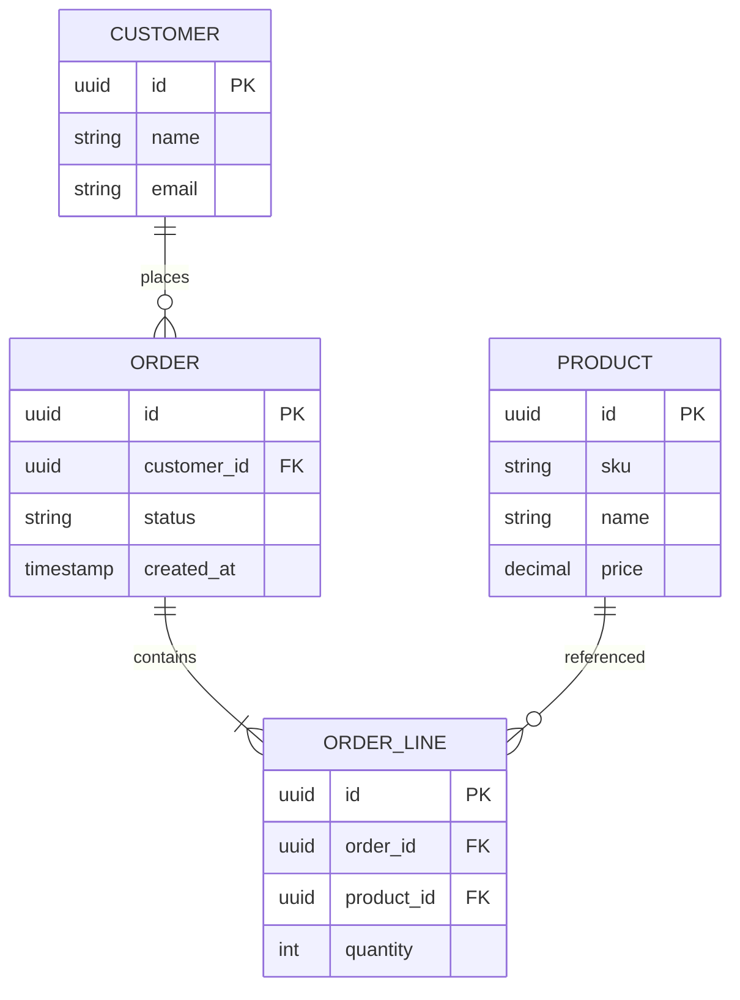

# ERD — Acme Platform

```mermaid
erDiagram
  CUSTOMER ||--o{ ORDER : places
  ORDER ||--|{ ORDER_LINE : contains
  PRODUCT ||--o{ ORDER_LINE : referenced
  CUSTOMER {
    uuid id PK
    string name
    string email
  }
  ORDER {
    uuid id PK
    uuid customer_id FK
    string status
    timestamp created_at
  }
  ORDER_LINE {
    uuid id PK
    uuid order_id FK
    uuid product_id FK
    int quantity
  }
  PRODUCT {
    uuid id PK
    string sku
    string name
    decimal price
  }
```
