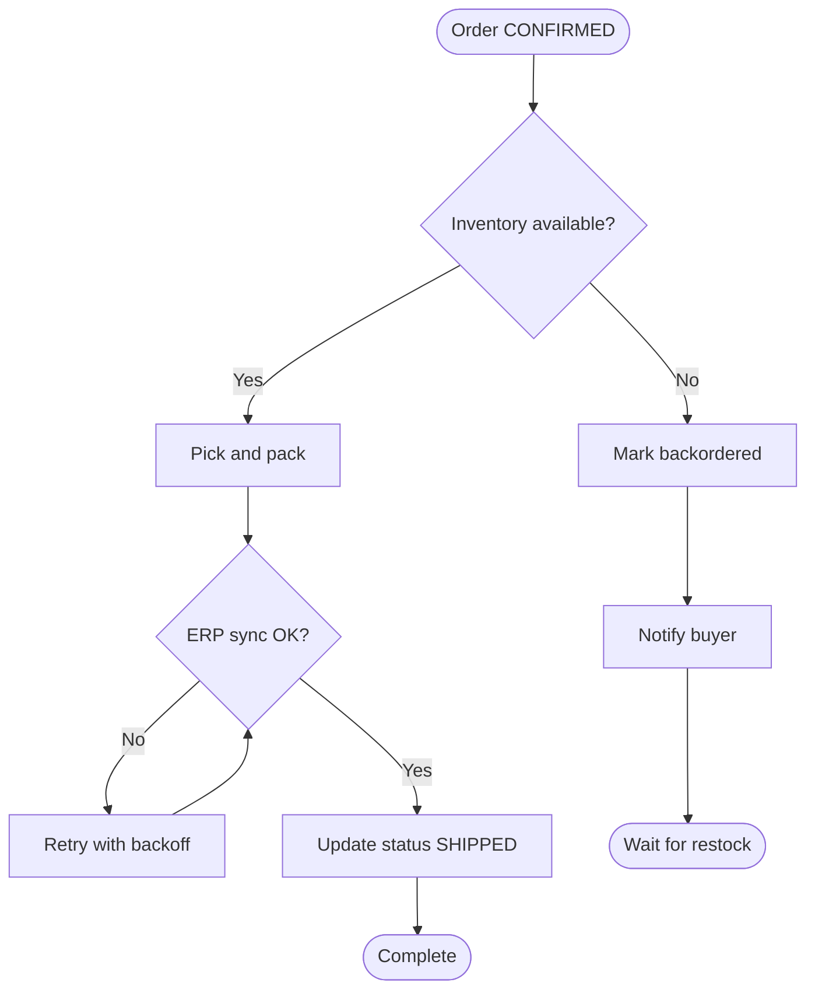

# Activity Diagram — Acme Platform

## Order fulfillment process

```mermaid
flowchart TD
  Start([Order CONFIRMED]) --> CheckInv{Inventory available?}
  CheckInv -->|No| Backorder[Mark backordered]
  Backorder --> NotifyBuyer[Notify buyer]
  CheckInv -->|Yes| Pick[Pick and pack]
  Pick --> SyncERP{ERP sync OK?}
  SyncERP -->|No| Retry[Retry with backoff]
  Retry --> SyncERP
  SyncERP -->|Yes| Ship[Update status SHIPPED]
  Ship --> End([Complete])
  NotifyBuyer --> Wait([Wait for restock])
```

Triggers [entity-state/example.md](../entity-state/example.md) transition CONFIRMED → SHIPPED.
