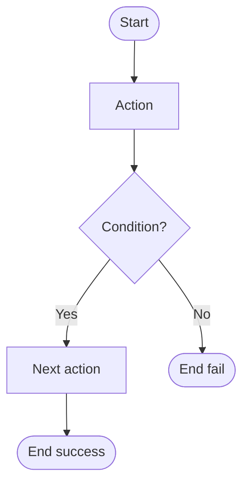

# Activity Diagram — Template

Business process with actions, decisions, and forks.

```mermaid
flowchart TD
  Start([Start]) --> Step1[Action]
  Step1 --> Decision{Condition?}
  Decision -->|Yes| Step2[Next action]
  Decision -->|No| Fail([End fail])
  Step2 --> End([End success])
```
