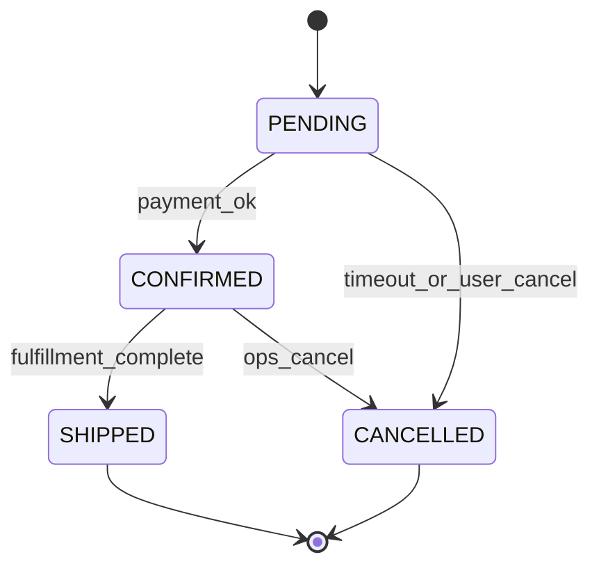

# Entity State Diagram — Acme Platform

## Order lifecycle

Maps to `ORDER.status` in [entity-relationship/example.md](../../data/entity-relationship/example.md).

| Transition | Guard | Side effect |
|------------|-------|-------------|
| PENDING → CONFIRMED | Payment authorized | Emit order.confirmed |
| CONFIRMED → SHIPPED | All lines picked | ERP webhook |
| * → CANCELLED | Policy allows | Release inventory |
