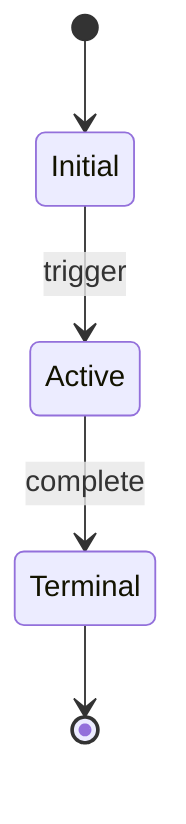

# Entity State Diagram — Template

Model lifecycle states for a domain entity. One diagram per stateful aggregate.

```mermaid
stateDiagram-v2
  [*] --> Initial
  Initial --> Active: trigger
  Active --> Terminal: complete
  Terminal --> [*]
```

Document transitions: event, guard condition, side effects.
