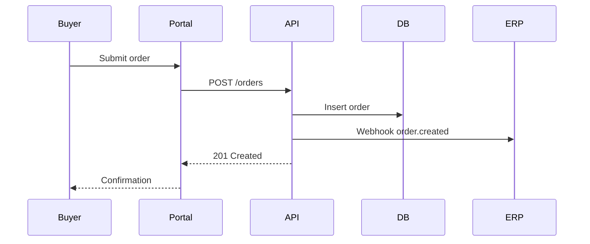

# Workflow Sequence — Acme Platform

## Create Order

```mermaid
sequenceDiagram
  participant Buyer
  participant Portal
  participant API
  participant DB
  participant ERP
  Buyer->>Portal: Submit order
  Portal->>API: POST /orders
  API->>DB: Insert order
  API->>ERP: Webhook order.created
  API-->>Portal: 201 Created
  Portal-->>Buyer: Confirmation
```
