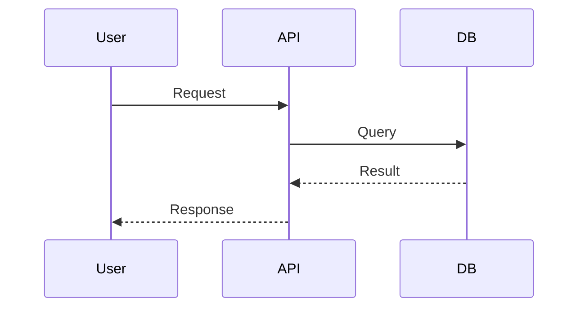

# Workflow Sequence — Template

Document request/response flows for key use cases.

```mermaid
sequenceDiagram
  participant User
  participant API
  participant DB
  User->>API: Request
  API->>DB: Query
  DB-->>API: Result
  API-->>User: Response
```
