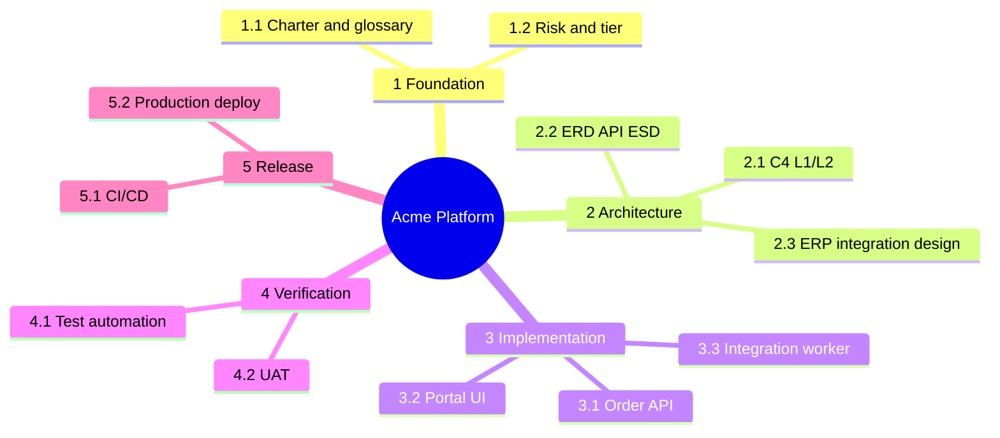

# Work Breakdown Structure — Acme Platform



## Text tree

```
Acme Platform
├── 1. Foundation (Manager)
│   ├── 1.1 Charter & glossary
│   └── 1.2 Risk & tier
├── 2. Architecture (Architect)
│   ├── 2.1 C4 + ERD + API
│   └── 2.2 Integration design
├── 3. Implementation (Developer)
│   ├── 3.1 Order API
│   └── 3.2 Portal UI
├── 4. Verification (QA)
└── 5. Release (DevOps)
```

Leaf tasks map to [sprint-planning/example.md](../sprint-planning/example.md) stories.
