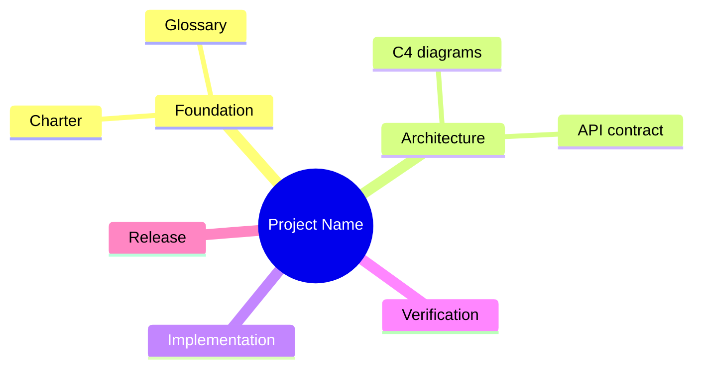

# Work Breakdown Structure — Template

Decompose project into deliverable work packages aligned with agent phases.



Or use numbered tree:

```
1.0 Project Name
├── 1.1 Work package
│   └── 1.1.1 Task
```
